# vSomeIP 深度架构解析文档

> 版本: 3.7.2 | 协议: SOME/IP | 语言: C++17 | 许可证: MPL-2.0
> 版权: Bayerische Motoren Werke Aktiengesellschaft (BMW AG)

---

## 目录

1. [项目概述](#1-项目概述)
2. [SOME/IP 协议基础](#2-someip-协议基础)
3. [系统总体架构](#3-系统总体架构)
4. [核心模块详解](#4-核心模块详解)
    - 4.1 [运行时与应用程序层](#41-运行时与应用程序层)
    - 4.2 [路由管理层](#42-路由管理层)
    - 4.3 [端点管理层](#43-端点管理层)
    - 4.4 [服务发现层](#44-服务发现层)
    - 4.5 [消息序列化层](#45-消息序列化层)
    - 4.6 [配置系统](#46-配置系统)
    - 4.7 [安全模块](#47-安全模块)
    - 4.8 [E2E 保护模块](#48-e2e-保护模块)
    - 4.9 [插件系统](#49-插件系统)
    - 4.10 [日志与追踪](#410-日志与追踪)
5. [通信流程详解](#5-通信流程详解)
    - 5.1 [服务提供流程](#51-服务提供流程)
    - 5.2 [服务发现流程](#52-服务发现流程)
    - 5.3 [请求/响应通信](#53-请求响应通信)
    - 5.4 [事件订阅与通知](#54-事件订阅与通知)
    - 5.5 [内部 IPC 协议](#55-内部-ipc-协议)
6. [应用程序生命周期](#6-应用程序生命周期)
7. [配置参考](#7-配置参考)
8. [构建与部署](#8-构建与部署)
9. [示例代码](#9-示例代码)

---

## 1. 项目概述

vSomeIP 是宝马（BMW）开源的一个 **SOME/IP 协议栈**实现，专为汽车嵌入式系统和 **AUTOSAR** 标准设计。它是实现车载以太网通信的核心中间件。

### 1.1 关键特性

- **完整的 SOME/IP 协议实现**：支持请求/响应、事件通知、字段（Field）等所有通信模式
- **服务发现（SD）**：基于 SOME/IP-SD 协议，支持服务的动态发现和管理
- **模块化插件架构**：核心库动态加载配置、服务发现、E2E 保护等插件
- **跨平台支持**：Linux、Android、QNX、Windows
- **灵活的传输层**：支持 TCP、UDP、Unix Domain Socket（UDS）、本地回环
- **安全策略框架**：支持基于 UID/GID 的细粒度访问控制
- **E2E 保护**：支持端到端数据完整性校验（AUTOSAR E2E 标准）
- **多线程异步 I/O**：基于 Boost.Asio 的事件驱动模型

### 1.2 架构总览

vSomeIP 采用 **中央路由管理器设计模式**，所有 IPC 通信均通过一个中心化的路由组件进行转发：

```
                        ┌──────────────────────────────────────┐
                        │           Application A              │
                        │     (Service Provider / Consumer)    │
                        │          libvsomeip3.so              │
                        └──────────────┬───────────────────────┘
                                       │
                        ┌──────────────┼───────────────────────┐
                        │              │   Internal IPC        │
                        │              │  (UDS / TCP)         │
                        │              │                       │
┌───────────────────────┼──────────────┼───────────────────────┼──────────────────┐
│                       │              │                       │                  │
│  ┌────────────────────┴──────────────┴───────────────────────┴──────────────┐  │
│  │                         Routing Manager                                 │  │
│  │                                                                          │  │
│  │  ┌─────────────────┐  ┌──────────────────┐  ┌────────────────────────┐  │  │
│  │  │ routing_manager  │  │ service_discovery│  │   endpoint_manager    │  │  │
│  │  │ _impl            │◄─┤ _impl            │──┤   _impl               │  │  │
│  │  │                  │  │ (SOME/IP-SD)     │  │  (TCP/UDP/UDS)        │  │  │
│  │  └─────────────────┘  └──────────────────┘  └────────────────────────┘  │  │
│  └──────────────────────────────────────────────────────────────────────────┘  │
│                                  │                                              │
│                          Network (TCP/UDP/IP)                                   │
└─────────────────────────────────────────────────────────────────────────────────┘
                                  │
                         ┌────────┴────────┐
                         │  External ECUs  │
                         │  (Remote Nodes) │
                         └─────────────────┘
```

### 1.3 库组成

| 库名称 | 目标 | 用途 |
|--------|------|------|
| `libvsomeip3.so` | `vsomeip3` | 核心库：端点、消息、路由、运行时、安全、日志、追踪、工具、线程管理 |
| `libvsomeip3-cfg.so` | `vsomeip3-cfg` | 配置插件：加载 JSON/文件配置 |
| `libvsomeip3-sd.so` | `vsomeip3-sd` | 服务发现插件：实现 SOME/IP SD 协议 |
| `libvsomeip3-e2e.so` | `vsomeip3-e2e` | E2E 保护插件：端到端数据完整性校验 |

### 1.4 项目结构

```
vsomeip/
├── CMakeLists.txt            # 主构建文件 (4个共享库 + 内部对象库)
├── interface/vsomeip/        # 公共 API 头文件
│   ├── vsomeip.hpp           # 统一入口头文件
│   ├── application.hpp       # 应用程序主 API
│   ├── runtime.hpp           # 运行时单例工厂
│   ├── message.hpp           # 消息接口
│   ├── payload.hpp           # 载荷接口
│   ├── message_base.hpp      # SOME/IP 消息头基类
│   ├── primitive_types.hpp   # 基本类型定义
│   ├── enumeration_types.hpp # 枚举类型定义
│   ├── constants.hpp         # 常量定义
│   ├── defines.hpp           # 协议常量/宏
│   ├── handler.hpp           # 回调函数类型
│   ├── plugin.hpp            # 插件基类
│   ├── internal/             # 内部接口（序列化、日志、插件管理、策略管理）
│   └── plugins/              # 插件接口（应用插件、预配置插件）
├── implementation/           # 私有实现源码
│   ├── configuration/        # 配置解析（JSON）
│   ├── endpoints/            # 网络端点（TCP/UDP/UDS/本地）
│   ├── logger/               # 日志实现
│   ├── message/              # 消息序列化/反序列化
│   ├── plugin/               # 插件加载基础设施
│   ├── protocol/             # 内部 IPC 协议 (30+ 命令类型)
│   ├── routing/              # 核心路由逻辑
│   ├── runtime/              # 应用生命周期管理
│   ├── security/             # 安全策略管理
│   ├── service_discovery/    # SOME/IP SD 协议
│   ├── thread_manager/       # 线程池管理
│   ├── tracing/              # DLT 追踪集成
│   └── utility/              # 工具函数
├── config/                   # 示例 JSON 配置文件
├── examples/                 # 示例程序
├── test/                     # 测试（单元/网络/基准）
├── tools/                    # 诊断工具、Wireshark 插件
└── documentation/            # 文档、图表
```

---

## 2. SOME/IP 协议基础

SOME/IP（Scalable service-Oriented MiddlewarE over IP）是车载以太网通信的核心应用层协议，由 AUTOSAR 标准化。

### 2.1 SOME/IP 消息头格式

```
 0                   1                   2                   3
 0 1 2 3 4 5 6 7 8 9 0 1 2 3 4 5 6 7 8 9 0 1 2 3 4 5 6 7 8 9 0 1
├─────────────────────────────────────────────────────────────────┤
│         Service ID (16)          │        Method ID (16)         │
├─────────────────────────────────────────────────────────────────┤
│         Length (32)              │      Client ID (16)           │
├─────────────────────────────────────────────────────────────────┤
│     Session ID (16)              │   Protocol Ver (8) │ Intf Ver│
├─────────────────────────────────────────────────────────────────┤
│  Message Type (8)│   Return Code (8)                            │
├─────────────────────────────────────────────────────────────────┤
│                         Payload (variable)                       │
└─────────────────────────────────────────────────────────────────┘
```

| 字段 | 大小 | 说明 |
|------|------|------|
| Service ID | 16 bit | 服务标识符 |
| Method ID | 16 bit | 方法/事件标识符 |
| Length | 32 bit | 从 Payload 开始的报文总长度 |
| Client ID | 16 bit | 客户端标识符 |
| Session ID | 16 bit | 会话标识符（递增） |
| Protocol Version | 8 bit | 协议版本（当前为 0x01） |
| Interface Version | 8 bit | 接口版本 |
| Message Type | 8 bit | 消息类型 |
| Return Code | 8 bit | 返回码 |

### 2.2 消息类型

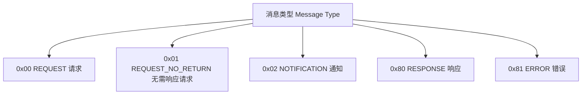
```mermaid
graph TD
    MT[消息类型 Message Type] --> REQ[0x00 REQUEST 请求]
    MT --> REQ_NR[0x01 REQUEST_NO_RETURN 无需响应请求]
    MT --> NOTIF[0x02 NOTIFICATION 通知]
    MT --> RESP[0x80 RESPONSE 响应]
    MT --> ERROR[0x81 ERROR 错误]
```

### 2.3 通信模式

SOME/IP 支持三种核心通信模式：

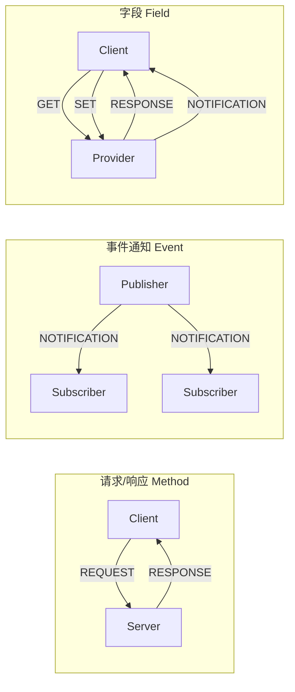
```mermaid
graph LR
    subgraph "请求/响应 Method"
        A[Client] -->|REQUEST| B[Server]
        B -->|RESPONSE| A
    end

    subgraph "事件通知 Event"
        C[Publisher] -->|NOTIFICATION| D[Subscriber]
        C -->|NOTIFICATION| E[Subscriber]
    end

    subgraph "字段 Field"
        F[Client] -->|GET| G[Provider]
        G -->|RESPONSE| F
        F -->|SET| G
        G -->|NOTIFICATION| F
    end
```

### 2.4 返回码

| 值 | 名称 | 说明 |
|----|------|------|
| 0x00 | E_OK | 正常 |
| 0x01 | E_NOT_OK | 异常 |
| 0x02 | E_UNKNOWN_SERVICE | 未知服务 |
| 0x03 | E_UNKNOWN_METHOD | 未知方法 |
| 0x04 | E_NOT_READY | 未就绪 |
| 0x05 | E_NOT_REACHABLE | 不可达 |
| 0x06 | E_TIMEOUT | 超时 |
| 0x07 | E_WRONG_PROTOCOL_VERSION | 协议版本错误 |
| 0x08 | E_WRONG_INTERFACE_VERSION | 接口版本错误 |
| 0x09 | E_MALFORMED_MESSAGE | 格式错误 |
| 0x0A | E_WRONG_MESSAGE_TYPE | 消息类型错误 |

---

## 3. 系统总体架构

### 3.1 分层架构图

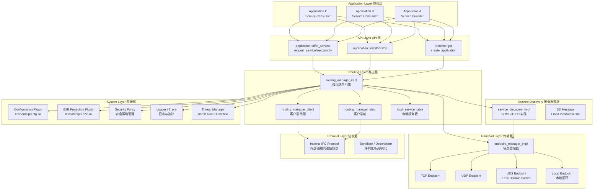
```mermaid
graph TB
    subgraph "Application Layer 应用层"
        APP1[Application A<br/>Service Provider]
        APP2[Application B<br/>Service Consumer]
        APP3[Application C<br/>Service Consumer]
    end

    subgraph "API Layer API 层"
        API1[runtime::get<br/>create_application]
        API2[application::init/start/stop]
        API3[application::offer_service<br/>request_service/send/notify]
    end

    subgraph "Routing Layer 路由层"
        RM[routing_manager_impl<br/>核心路由引擎]
        RM_STUB[routing_manager_stub<br/>客户端桩]
        RM_CLIENT[routing_manager_client<br/>客户端代理]
        LOST[local_service_table<br/>本地服务表]
    end

    subgraph "Service Discovery 服务发现层"
        SD[service_discovery_impl<br/>SOME/IP-SD 实现]
        SD_MSG[SD Message<br/>Find/Offer/Subscribe]
    end

    subgraph "Transport Layer 传输层"
        EP_MGR[endpoint_manager_impl<br/>端点管理器]
        TCP[TCP Endpoint]
        UDP[UDP Endpoint]
        UDS[UDS Endpoint<br/>Unix Domain Socket]
        LOCAL[Local Endpoint<br/>本地回环]
    end

    subgraph "Protocol Layer 协议层"
        PROTO[Internal IPC Protocol<br/>内部进程间通信协议]
        SERIAL[Serializer / Deserializer<br/>序列化/反序列化]
    end

    subgraph "System Layer 系统层"
        CFG[Configuration Plugin<br/>libvsomeip3-cfg.so]
        E2E[E2E Protection Plugin<br/>libvsomeip3-e2e.so]
        SEC[Security Policy<br/>安全策略管理]
        LOG[Logger / Trace<br/>日志与追踪]
        THREAD[Thread Manager<br/>Boost.Asio IO Context]
    end

    APP1 & APP2 & APP3 --> API1 & API2 & API3
    API1 & API2 & API3 --> RM
    RM --> SD
    RM --> RM_STUB & RM_CLIENT
    RM_STUB & RM_CLIENT --> PROTO
    RM --> LOST
    SD --> EP_MGR
    RM --> EP_MGR
    EP_MGR --> TCP & UDP & UDS & LOCAL
    RM --> CFG & E2E & SEC & LOG & THREAD
```

### 3.2 中央路由管理器模式

vSomeIP 的架构核心是 **中央路由管理器模式**，其设计理念如下：

- **每个设备只有一个路由管理器**：负责任何所有本地应用之间以及本地和远程节点之间的消息路由
- **路由管理器可内嵌或独立运行**：可以嵌入某个应用程序进程，也可以作为独立守护进程（`routingmanagerd`）运行
- **所有 IPC 通信使用内部协议**：应用程序与路由管理器之间通过 UDS 或 TCP 使用私有协议通信

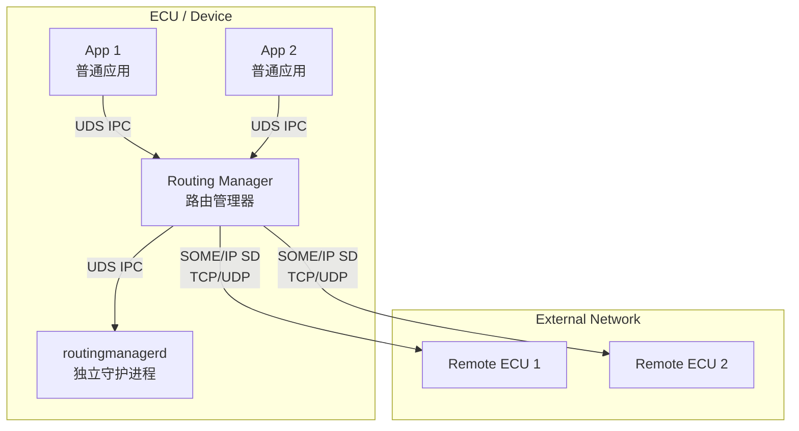
```mermaid
graph TB
    subgraph "ECU / Device"
        RM[Routing Manager<br/>路由管理器]
        APP1[App 1<br/>普通应用]
        APP2[App 2<br/>普通应用]
        DAEMON[routingmanagerd<br/>独立守护进程]

        APP1 -->|UDS IPC| RM
        APP2 -->|UDS IPC| RM
        RM -->|UDS IPC| DAEMON
    end

    subgraph "External Network"
        REMOTE1[Remote ECU 1]
        REMOTE2[Remote ECU 2]
    end

    RM -->|SOME/IP SD<br/>TCP/UDP| REMOTE1
    RM -->|SOME/IP SD<br/>TCP/UDP| REMOTE2
```

**路由管理器职责：**
1. 维护设备内所有服务提供/订阅信息
2. 转发应用程序间的消息
3. 运行服务发现协议，管理远程通信
4. 管理安全策略
5. 管理端点创建和生命周期

### 3.3 四种进程模型

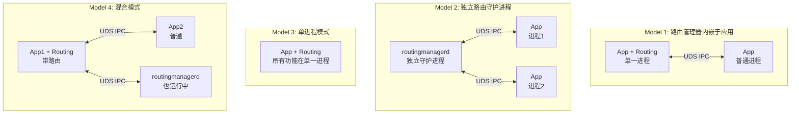
```mermaid
graph TD
    subgraph "Model 1: 路由管理器内嵌于应用"
        A[App + Routing<br/>单一进程]
        B[App<br/>普通进程]
        A <-->|UDS IPC| B
    end

    subgraph "Model 2: 独立路由守护进程"
        D[routingmanagerd<br/>独立守护进程]
        E[App<br/>进程1]
        F[App<br/>进程2]
        D <-->|UDS IPC| E
        D <-->|UDS IPC| F
    end

    subgraph "Model 3: 单进程模式"
        G[App + Routing<br/>所有功能在单一进程]
    end

    subgraph "Model 4: 混合模式"
        H[App1 + Routing<br/>带路由]
        I[App2<br/>普通]
        J[routingmanagerd<br/>也运行中]
        H <-->|UDS IPC| I
        H <-->|UDS IPC| J
    end
```

---

## 4. 核心模块详解

### 4.1 运行时与应用程序层

#### 4.1.1 runtime（运行时单例）

`runtime` 是 vSomeIP 的入口点，是一个全局单例工厂类：

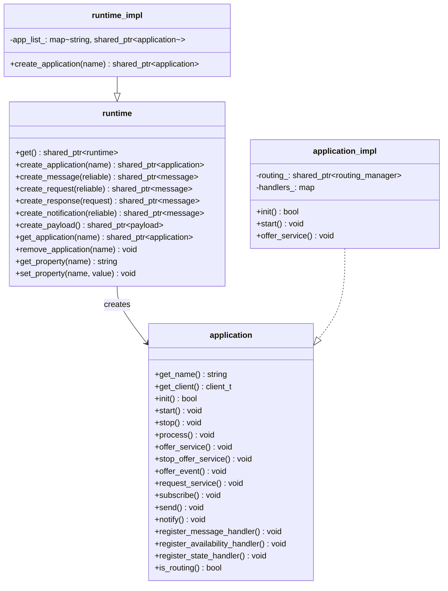
```mermaid
classDiagram
    class runtime {
        +get() shared_ptr~runtime~
        +create_application(name) shared_ptr~application~
        +create_message(reliable) shared_ptr~message~
        +create_request(reliable) shared_ptr~message~
        +create_response(request) shared_ptr~message~
        +create_notification(reliable) shared_ptr~message~
        +create_payload() shared_ptr~payload~
        +get_application(name) shared_ptr~application~
        +remove_application(name) void
        +get_property(name) string
        +set_property(name, value) void
    }

    class application {
        +get_name() string
        +get_client() client_t
        +init() bool
        +start() void
        +stop() void
        +process() void
        +offer_service() void
        +stop_offer_service() void
        +offer_event() void
        +request_service() void
        +subscribe() void
        +send() void
        +notify() void
        +register_message_handler() void
        +register_availability_handler() void
        +register_state_handler() void
        +is_routing() bool
    }

    runtime --> application : creates
    
    class runtime_impl {
        -app_list_: map~string, shared_ptr~application~~
        +create_application(name) shared_ptr~application~
    }

    class application_impl {
        -routing_: shared_ptr~routing_manager~
        -handlers_: map
        +init() bool
        +start() void
        +offer_service() void
    }

    runtime_impl --|> runtime
    application_impl ..|> application
```

`runtime::get()` 加载配置插件（`libvsomeip3-cfg.so`），从中获取 `runtime` 具体实现。

#### 4.1.2 application（应用程序 API）

`application` 是用户使用 vSomeIP 的主要接口，每个进程通常只创建一个实例。

**关键 API 分组：**

| 类别 | 方法 | 说明 |
|------|------|------|
| 生命周期 | `init()` → `start()` → `stop()` | 应用初始化、启动、停止 |
| 服务提供 | `offer_service()` / `stop_offer_service()` | 提供服务实例 |
| 服务请求 | `request_service()` / `release_service()` | 请求使用服务 |
| 事件/字段 | `offer_event()` / `notify()` / `notify_one()` | 提供事件并发送通知 |
| 事件订阅 | `request_event()` / `subscribe()` / `unsubscribe()` | 订阅事件 |
| 消息发送 | `send()` | 发送 SOME/IP 消息 |
| 回调注册 | `register_message_handler()` | 注册消息处理器 |
| 可用性 | `register_availability_handler()` | 注册服务可用性回调 |
| 状态 | `register_state_handler()` | 注册注册状态回调 |
| 订阅 | `register_subscription_handler()` | 注册订阅处理（访问控制） |
| 安全 | `update_security_policy_configuration()` | 更新安全策略 |

### 4.2 路由管理层

路由层是 vSomeIP 的核心，负责所有消息的转发和路由决策。

#### 4.2.1 类层次结构

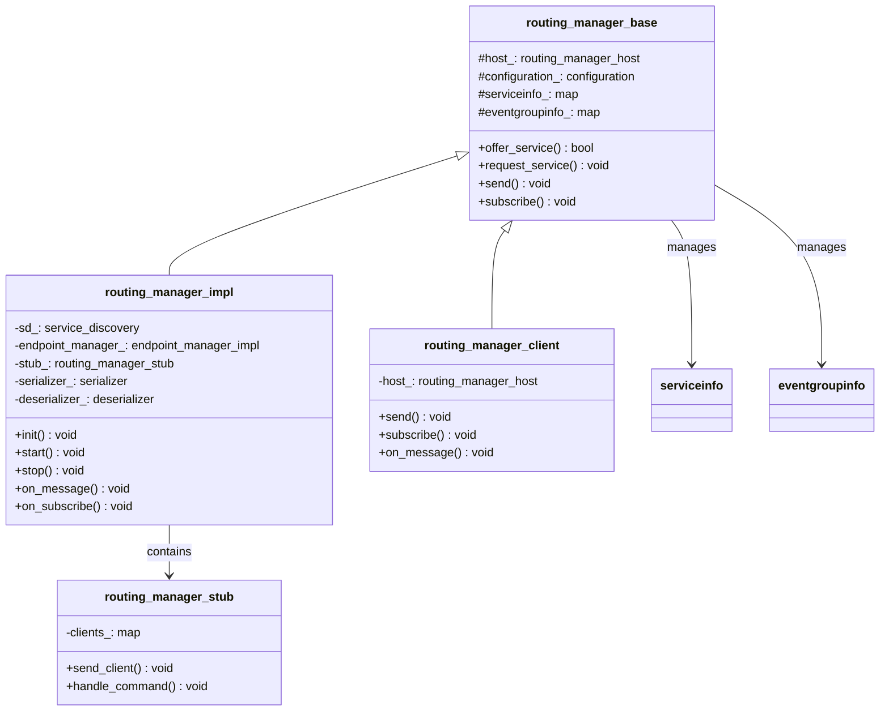
```mermaid
classDiagram
    class routing_manager_base {
        #host_: routing_manager_host
        #configuration_: configuration
        #serviceinfo_: map
        #eventgroupinfo_: map
        +offer_service() bool
        +request_service() void
        +send() void
        +subscribe() void
    }

    class routing_manager_impl {
        -sd_: service_discovery
        -endpoint_manager_: endpoint_manager_impl
        -stub_: routing_manager_stub
        -serializer_: serializer
        -deserializer_: deserializer
        +init() void
        +start() void
        +stop() void
        +on_message() void
        +on_subscribe() void
    }

    class routing_manager_client {
        -host_: routing_manager_host
        +send() void
        +subscribe() void
        +on_message() void
    }

    class routing_manager_stub {
        -clients_: map
        +send_client() void
        +handle_command() void
    }

    routing_manager_base <|-- routing_manager_impl
    routing_manager_base <|-- routing_manager_client
    routing_manager_impl --> routing_manager_stub : contains
    routing_manager_base --> serviceinfo : manages
    routing_manager_base --> eventgroupinfo : manages
```

#### 4.2.2 routing_manager_impl（中央路由引擎）

`routing_manager_impl` 是路由管理器实现的全部主体，它继承自多个接口：

```
routing_manager_impl
  ├── routing_manager_base        # 基础路由功能
  ├── boardnet_routing_host        # 板级网络路由
  ├── routing_manager_stub_host    # 客户端 stub 宿主
  ├── service_discovery_host       # 服务发现宿主
  ├── event_dispatcher             # 事件分发器
  └── enable_shared_from_this      # 共享指针支持
```

**核心职责：**

1. **服务管理**：维护服务的注册信息（`serviceinfo` 映射表），处理 `offer_service` 和 `request_service`
2. **事件管理**：管理事件组（`eventgroupinfo`），处理事件订阅和通知分发
3. **消息路由**：根据目标地址将消息转发到正确的端点
4. **远程通信协调**：与服务发现模块协作，管理远程服务的可见性和可达性

### 4.3 端点管理层

端点层抽象了所有传输方式，提供统一的网络通信接口。

#### 4.3.1 端点类型

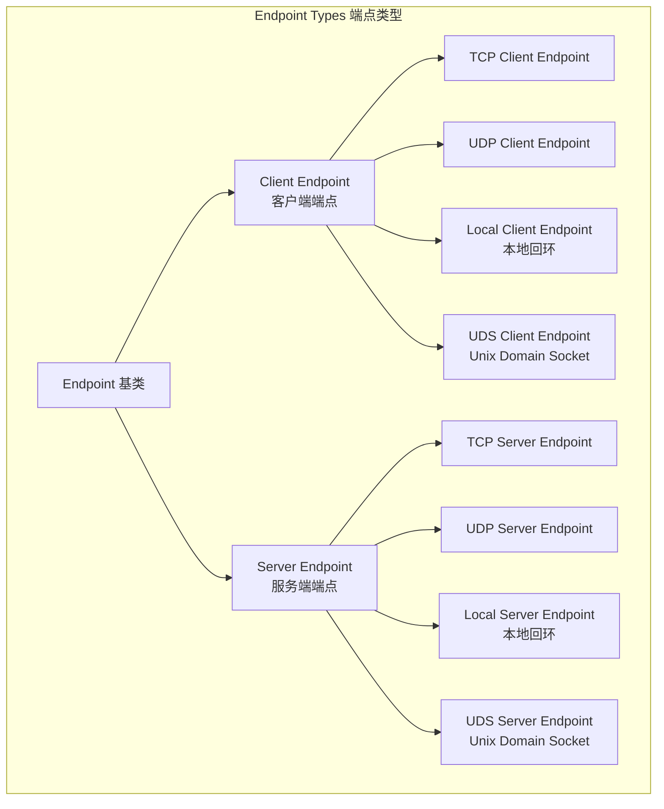
```mermaid
graph TB
    subgraph "Endpoint Types 端点类型"
        EP[Endpoint 基类]
        EP_CLIENT[Client Endpoint<br/>客户端端点]
        EP_SERVER[Server Endpoint<br/>服务端端点]

        TCP_CLIENT[TCP Client Endpoint]
        TCP_SERVER[TCP Server Endpoint]
        UDP_CLIENT[UDP Client Endpoint]
        UDP_SERVER[UDP Server Endpoint]
        LOCAL_CLIENT[Local Client Endpoint<br/>本地回环]
        LOCAL_SERVER[Local Server Endpoint<br/>本地回环]
        UDS_CLIENT[UDS Client Endpoint<br/>Unix Domain Socket]
        UDS_SERVER[UDS Server Endpoint<br/>Unix Domain Socket]
    end

    EP --> EP_CLIENT
    EP --> EP_SERVER
    EP_CLIENT --> TCP_CLIENT
    EP_CLIENT --> UDP_CLIENT
    EP_CLIENT --> LOCAL_CLIENT
    EP_CLIENT --> UDS_CLIENT
    EP_SERVER --> TCP_SERVER
    EP_SERVER --> UDP_SERVER
    EP_SERVER --> LOCAL_SERVER
    EP_SERVER --> UDS_SERVER
```

#### 4.3.2 端点管理器

`endpoint_manager_impl` 负责：

- 根据配置创建和管理所有端点
- 维护端点到服务实例的映射关系
- 处理大消息的分段与重组（`tp` - Transport Protocol 模块）
- 管理和复用 TCP 连接

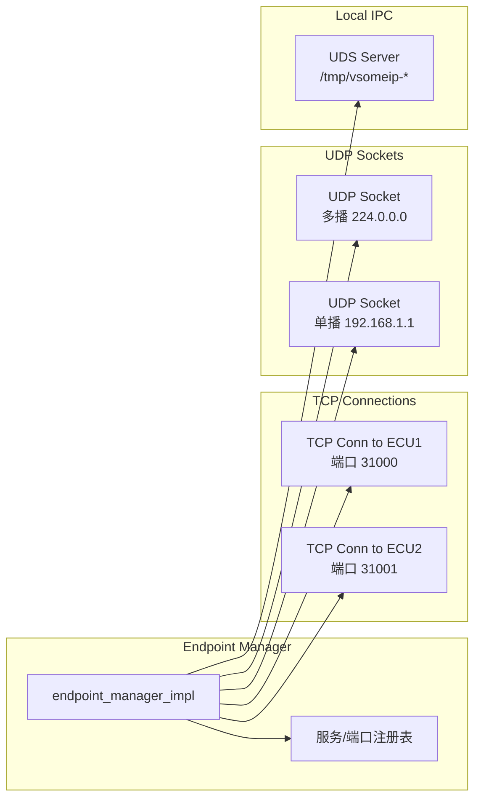
```mermaid
graph LR
    subgraph "Endpoint Manager"
        EM[endpoint_manager_impl]
        REG[服务/端口注册表]
    end

    subgraph "TCP Connections"
        TCP1[TCP Conn to ECU1<br/>端口 31000]
        TCP2[TCP Conn to ECU2<br/>端口 31001]
    end

    subgraph "UDP Sockets"
        UDP1[UDP Socket<br/>多播 224.0.0.0]
        UDP2[UDP Socket<br/>单播 192.168.1.1]
    end

    subgraph "Local IPC"
        UDS[UDS Server<br/>/tmp/vsomeip-*]
    end

    EM --> TCP1 & TCP2
    EM --> UDP1 & UDP2
    EM --> UDS
    EM --> REG
```

### 4.4 服务发现层

服务发现（SD）实现了 AUTOSAR SOME/IP-SD 协议，使设备能动态发现彼此的服务。

#### 4.4.1 SD 消息类型

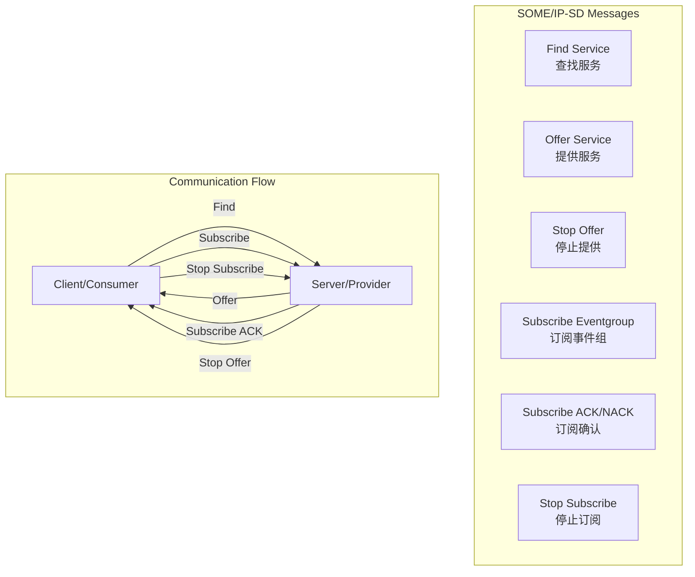
```mermaid
graph TD
    subgraph "SOME/IP-SD Messages"
        FIND[Find Service<br/>查找服务]
        OFFER[Offer Service<br/>提供服务]
        STOP_OFFER[Stop Offer<br/>停止提供]
        SUBSCRIBE[Subscribe Eventgroup<br/>订阅事件组]
        SUBSCRIBE_ACK[Subscribe ACK/NACK<br/>订阅确认]
        SUBSCRIBE_STOP[Stop Subscribe<br/>停止订阅]
    end

    subgraph "Communication Flow"
        CLIENT[Client/Consumer]
        SERVER[Server/Provider]
    end

    CLIENT -->|Find| SERVER
    SERVER -->|Offer| CLIENT
    CLIENT -->|Subscribe| SERVER
    SERVER -->|Subscribe ACK| CLIENT
    SERVER -->|Stop Offer| CLIENT
    CLIENT -->|Stop Subscribe| SERVER
```

#### 4.4.2 SD 状态机

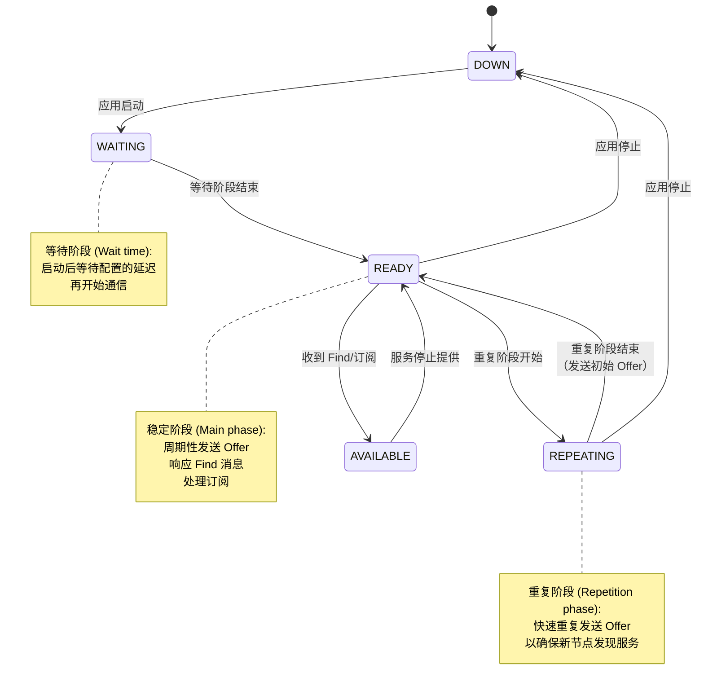
```mermaid
stateDiagram-v2
    [*] --> DOWN

    DOWN --> WAITING: 应用启动
    WAITING --> READY: 等待阶段结束

    READY --> REPEATING: 重复阶段开始
    REPEATING --> READY: 重复阶段结束<br/>（发送初始 Offer）

    READY --> AVAILABLE: 收到 Find/订阅
    AVAILABLE --> READY: 服务停止提供

    READY --> DOWN: 应用停止
    REPEATING --> DOWN: 应用停止

    note right of WAITING
        等待阶段 (Wait time):
        启动后等待配置的延迟
        再开始通信
    end note

    note right of REPEATING
        重复阶段 (Repetition phase):
        快速重复发送 Offer
        以确保新节点发现服务
    end note

    note right of READY
        稳定阶段 (Main phase):
        周期性发送 Offer
        响应 Find 消息
        处理订阅
    end note
```

#### 4.4.3 SD 核心类

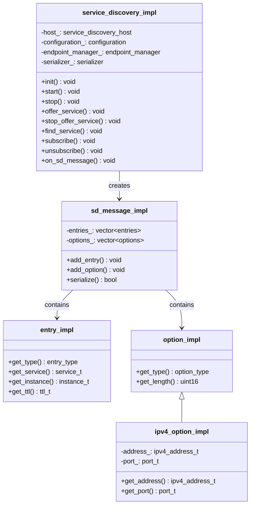
```mermaid
classDiagram
    class service_discovery_impl {
        -host_: service_discovery_host
        -configuration_: configuration
        -endpoint_manager_: endpoint_manager
        -serializer_: serializer
        +init() void
        +start() void
        +stop() void
        +offer_service() void
        +stop_offer_service() void
        +find_service() void
        +subscribe() void
        +unsubscribe() void
        +on_sd_message() void
    }

    class sd_message_impl {
        -entries_: vector~entries~
        -options_: vector~options~
        +add_entry() void
        +add_option() void
        +serialize() bool
    }

    class entry_impl {
        +get_type() entry_type
        +get_service() service_t
        +get_instance() instance_t
        +get_ttl() ttl_t
    }

    class option_impl {
        +get_type() option_type
        +get_length() uint16
    }

    class ipv4_option_impl {
        -address_: ipv4_address_t
        -port_: port_t
        +get_address() ipv4_address_t
        +get_port() port_t
    }

    service_discovery_impl --> sd_message_impl : creates
    sd_message_impl --> entry_impl : contains
    sd_message_impl --> option_impl : contains
    option_impl <|-- ipv4_option_impl
```

### 4.5 消息序列化层

#### 4.5.1 SOME/IP 消息实现

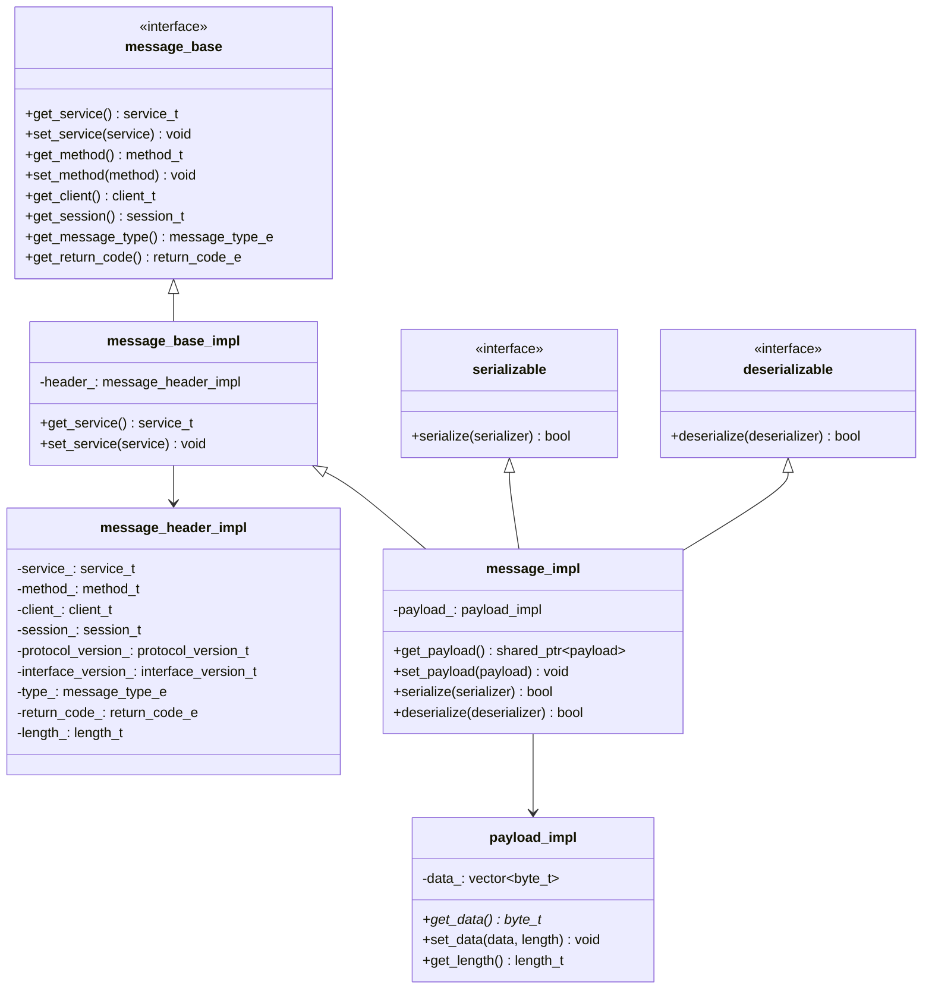
```mermaid
classDiagram
    class message_base {
        <<interface>>
        +get_service() service_t
        +set_service(service) void
        +get_method() method_t
        +set_method(method) void
        +get_client() client_t
        +get_session() session_t
        +get_message_type() message_type_e
        +get_return_code() return_code_e
    }

    class serializable {
        <<interface>>
        +serialize(serializer) bool
    }

    class deserializable {
        <<interface>>
        +deserialize(deserializer) bool
    }

    class message_base_impl {
        -header_: message_header_impl
        +get_service() service_t
        +set_service(service) void
    }

    class message_header_impl {
        -service_: service_t
        -method_: method_t
        -client_: client_t
        -session_: session_t
        -protocol_version_: protocol_version_t
        -interface_version_: interface_version_t
        -type_: message_type_e
        -return_code_: return_code_e
        -length_: length_t
    }

    class message_impl {
        -payload_: payload_impl
        +get_payload() shared_ptr~payload~
        +set_payload(payload) void
        +serialize(serializer) bool
        +deserialize(deserializer) bool
    }

    class payload_impl {
        -data_: vector~byte_t~
        +get_data() byte_t*
        +set_data(data, length) void
        +get_length() length_t
    }

    message_base <|-- message_base_impl
    message_base_impl --> message_header_impl
    message_base_impl <|-- message_impl
    message_impl --> payload_impl

    serializable <|-- message_impl
    deserializable <|-- message_impl
```

#### 4.5.2 序列化流程

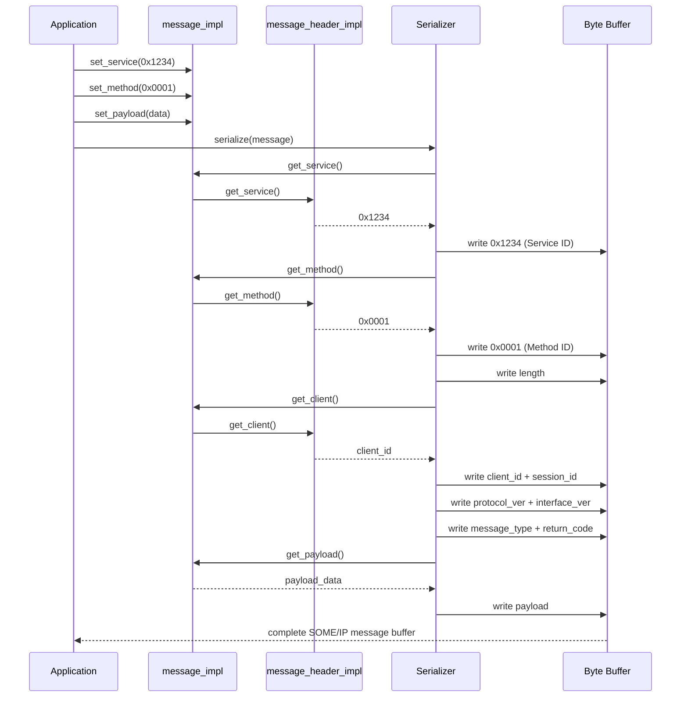
```mermaid
sequenceDiagram
    participant App as Application
    participant Msg as message_impl
    participant Hdr as message_header_impl
    participant Ser as Serializer
    participant Buf as Byte Buffer

    App->>Msg: set_service(0x1234)
    App->>Msg: set_method(0x0001)
    App->>Msg: set_payload(data)
    App->>Ser: serialize(message)

    Ser->>Msg: get_service()
    Msg->>Hdr: get_service()
    Hdr-->>Ser: 0x1234
    Ser->>Buf: write 0x1234 (Service ID)

    Ser->>Msg: get_method()
    Msg->>Hdr: get_method()
    Hdr-->>Ser: 0x0001
    Ser->>Buf: write 0x0001 (Method ID)

    Ser->>Buf: write length
    Ser->>Msg: get_client()
    Msg->>Hdr: get_client()
    Hdr-->>Ser: client_id
    Ser->>Buf: write client_id + session_id

    Ser->>Buf: write protocol_ver + interface_ver
    Ser->>Buf: write message_type + return_code
    Ser->>Msg: get_payload()
    Msg-->>Ser: payload_data
    Ser->>Buf: write payload

    Buf-->>App: complete SOME/IP message buffer
```

### 4.6 配置系统

#### 4.6.1 配置架构

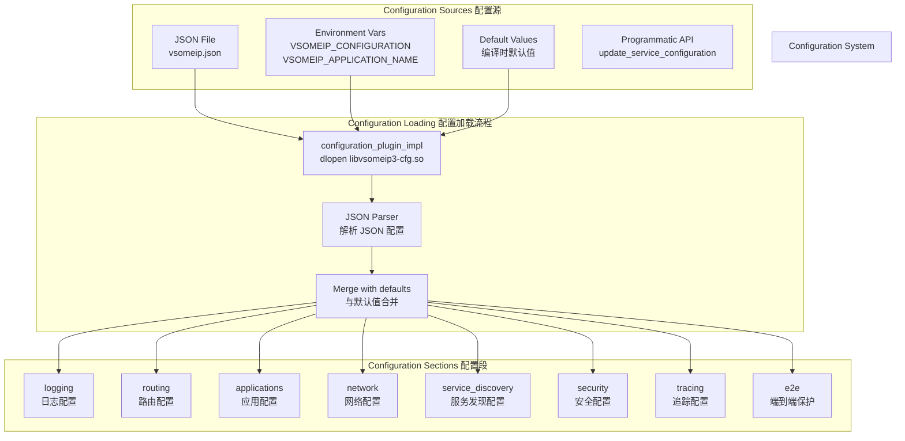
```mermaid
graph TB
    CFG[Configuration System]

    subgraph "Configuration Sources 配置源"
        S1[JSON File<br/>vsomeip.json]
        S2[Environment Vars<br/>VSOMEIP_CONFIGURATION<br/>VSOMEIP_APPLICATION_NAME]
        S3[Default Values<br/>编译时默认值]
        S4[Programmatic API<br/>update_service_configuration]
    end

    subgraph "Configuration Loading 配置加载流程"
        LOAD[configuration_plugin_impl<br/>dlopen libvsomeip3-cfg.so]
        PARSE[JSON Parser<br/>解析 JSON 配置]
        MERGE[Merge with defaults<br/>与默认值合并]
    end

    subgraph "Configuration Sections 配置段"
        LOG_CFG[logging<br/>日志配置]
        ROUTE_CFG[routing<br/>路由配置]
        APP_CFG[applications<br/>应用配置]
        NET_CFG[network<br/>网络配置]
        SD_CFG[service_discovery<br/>服务发现配置]
        SEC_CFG[security<br/>安全配置]
        TRACE_CFG[tracing<br/>追踪配置]
        E2E_CFG[e2e<br/>端到端保护]
    end

    S1 & S2 & S3 --> LOAD
    LOAD --> PARSE --> MERGE
    MERGE --> LOG_CFG
    MERGE --> ROUTE_CFG
    MERGE --> APP_CFG
    MERGE --> NET_CFG
    MERGE --> SD_CFG
    MERGE --> SEC_CFG
    MERGE --> TRACE_CFG
    MERGE --> E2E_CFG
```

#### 4.6.2 默认配置

| 参数 | 默认值 | 环境变量 |
|------|--------|----------|
| 配置文件路径 | `/etc/vsomeip.json` | `VSOMEIP_CONFIGURATION` |
| 配置文件夹 | `/etc/vsomeip/` | `VSOMEIP_CONFIGURATION` |
| 应用名称 | - | `VSOMEIP_APPLICATION_NAME` |
| 基础路径（UDS） | `/tmp/` | - |
| 单播地址 | `127.0.0.1` | - |
| 诊断地址 | `0x01` | - |
| 默认端口 | `31490` | - |
| 日志级别 | `info` | - |
| I/O 线程数 | `2` | - |

### 4.7 安全模块

#### 4.7.1 安全架构

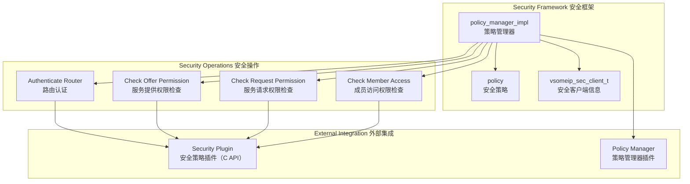
```mermaid
graph TB
    subgraph "Security Framework 安全框架"
        PM[policy_manager_impl<br/>策略管理器]
        POLICY[policy<br/>安全策略]
        SEC_CLIENT[vsomeip_sec_client_t<br/>安全客户端信息]
    end

    subgraph "Security Operations 安全操作"
        AUTH[Authenticate Router<br/>路由认证]
        OFFER_CHECK[Check Offer Permission<br/>服务提供权限检查]
        REQ_CHECK[Check Request Permission<br/>服务请求权限检查]
        MEMBER_CHECK[Check Member Access<br/>成员访问权限检查]
    end

    subgraph "External Integration 外部集成"
        SEC_PLUGIN[Security Plugin<br/>安全策略插件（C API）]
        POL_MGR[Policy Manager<br/>策略管理器插件]
    end

    PM --> POLICY
    PM --> SEC_CLIENT
    PM --> AUTH & OFFER_CHECK & REQ_CHECK & MEMBER_CHECK
    AUTH & OFFER_CHECK & REQ_CHECK & MEMBER_CHECK --> SEC_PLUGIN
    PM --> POL_MGR
```

#### 4.7.2 安全模式

| 模式 | 值 | 说明 |
|------|-----|------|
| SM_OFF | 0x00 | 安全关闭，不执行策略检查 |
| SM_ON | 0x01 | 安全开启，拒绝未授权的操作 |
| SM_AUDIT | 0x02 | 审计模式，记录违规但不阻止 |

#### 4.7.3 安全策略 C API

`vsomeip_sec.h` 定义了安全策略插件接口：

| 函数 | 说明 |
|------|------|
| `vsomeip_sec_policy_initialize` | 初始化安全策略 |
| `vsomeip_sec_policy_authenticate_router` | 验证路由管理器身份 |
| `vsomeip_sec_policy_is_client_allowed_to_offer` | 检查客户端是否可以提供服务 |
| `vsomeip_sec_policy_is_client_allowed_to_request` | 检查客户端是否可以请求服务 |
| `vsomeip_sec_policy_is_client_allowed_to_access_member` | 检查客户端是否可以访问成员 |

### 4.8 E2E 保护模块

E2E（End-to-End）保护模块实现了 AUTOSAR E2E 规范，提供数据完整性校验：

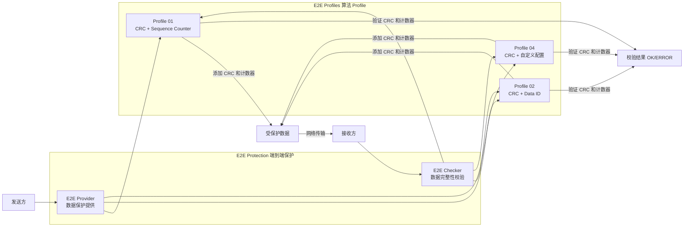
```mermaid
graph LR
    subgraph "E2E Protection 端到端保护"
        E2E_PROV[E2E Provider<br/>数据保护提供]
        E2E_CHK[E2E Checker<br/>数据完整性校验]
    end

    subgraph "E2E Profiles 算法 Profile"
        P1[Profile 01<br/>CRC + Sequence Counter]
        P2[Profile 02<br/>CRC + Data ID]
        P4[Profile 04<br/>CRC + 自定义配置]
    end

    SENDER[发送方] --> E2E_PROV
    E2E_PROV --> P1 & P2 & P4
    P1 & P2 & P4 -->|添加 CRC 和计数器| DATA[受保护数据]
    DATA -->|网络传输| RECEIVER[接收方]
    RECEIVER --> E2E_CHK
    E2E_CHK --> P1 & P2 & P4
    P1 & P2 & P4 -->|验证 CRC 和计数器| RESULT[校验结果 OK/ERROR]
```

### 4.9 插件系统

#### 4.9.1 插件类型

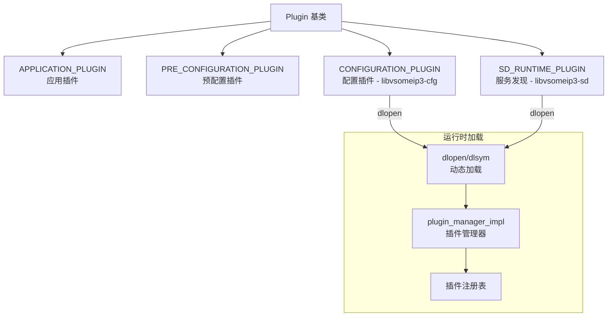
```mermaid
graph TD
    PLUGIN[Plugin 基类]

    APP_PLUGIN[APPLICATION_PLUGIN<br/>应用插件]
    PRE_CFG_PLUGIN[PRE_CONFIGURATION_PLUGIN<br/>预配置插件]
    CFG_PLUGIN[CONFIGURATION_PLUGIN<br/>配置插件 - libvsomeip3-cfg]
    SD_PLUGIN[SD_RUNTIME_PLUGIN<br/>服务发现 - libvsomeip3-sd]

    PLUGIN --> APP_PLUGIN
    PLUGIN --> PRE_CFG_PLUGIN
    PLUGIN --> CFG_PLUGIN
    PLUGIN --> SD_PLUGIN

    subgraph "运行时加载"
        DLOPEN[dlopen/dlsym<br/>动态加载]
        PLUGIN_MGR[plugin_manager_impl<br/>插件管理器]
        PLUGIN_MAP[插件注册表]
    end

    CFG_PLUGIN -->|dlopen| DLOPEN
    SD_PLUGIN -->|dlopen| DLOPEN
    DLOPEN --> PLUGIN_MGR
    PLUGIN_MGR --> PLUGIN_MAP
```

#### 4.9.2 插件加载流程

1. 核心库启动时调用 `plugin_manager_impl::load_plugins()`
2. 扫描预定义的插件路径，依次尝试 `dlopen`：
   - `libvsomeip3-cfg.so`
   - `libvsomeip3-sd.so`
   - `libvsomeip3-e2e.so`
3. 每个 `.so` 文件中通过 `VSOMEIP_PLUGIN()` 宏注册插件创建函数
4. 插件管理器将加载的插件存入注册表，供后续按类型查找

### 4.10 日志与追踪

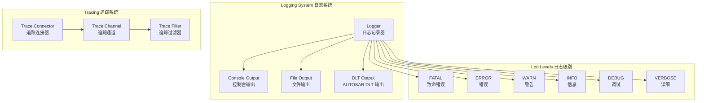
```mermaid
graph TB
    subgraph "Logging System 日志系统"
        LOGGER[Logger<br/>日志记录器]
        CONSOLE[Console Output<br/>控制台输出]
        FILE[File Output<br/>文件输出]
        DLT[DLT Output<br/>AUTOSAR DLT 输出]
    end

    subgraph "Log Levels 日志级别"
        FATAL[FATAL<br/>致命错误]
        ERROR[ERROR<br/>错误]
        WARN[WARN<br/>警告]
        INFO[INFO<br/>信息]
        DEBUG[DEBUG<br/>调试]
        VERBOSE[VERBOSE<br/>详细]
    end

    subgraph "Tracing 追踪系统"
        TRACE[Trace Connector<br/>追踪连接器]
        TRACE_CH[Trace Channel<br/>追踪通道]
        TRACE_FILTER[Trace Filter<br/>追踪过滤器]
    end

    LOGGER --> CONSOLE & FILE & DLT
    LOGGER --> FATAL & ERROR & WARN & INFO & DEBUG & VERBOSE
    TRACE --> TRACE_CH --> TRACE_FILTER
```

---

## 5. 通信流程详解

### 5.1 服务提供流程

这是 vSomeIP 中最核心的流程之一：服务提供者注册服务 → 路由管理器注册 → SD 对外通告。

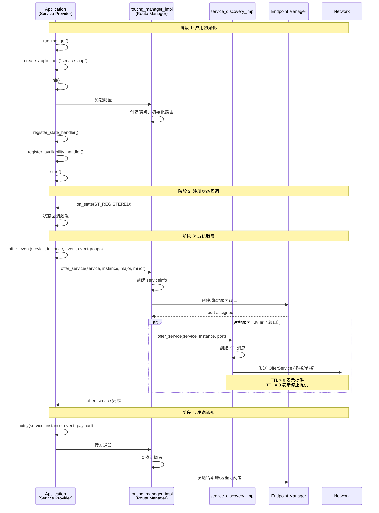
```mermaid
sequenceDiagram
    participant App as Application<br/>(Service Provider)
    participant RM as routing_manager_impl<br/>(Route Manager)
    participant SD as service_discovery_impl
    participant EP as Endpoint Manager
    participant Net as Network

    Note over App,Net: 阶段 1: 应用初始化
    App->>App: runtime::get()
    App->>App: create_application("service_app")
    App->>App: init()
    App->>RM: 加载配置
    RM->>RM: 创建端点、初始化路由

    App->>App: register_state_handler()
    App->>App: register_availability_handler()
    App->>App: start()

    Note over App,Net: 阶段 2: 注册状态回调
    RM->>App: on_state(ST_REGISTERED)
    App->>App: 状态回调触发

    Note over App,Net: 阶段 3: 提供服务
    App->>App: offer_event(service, instance, event, eventgroups)
    App->>RM: offer_service(service, instance, major, minor)

    RM->>RM: 创建 serviceinfo
    RM->>EP: 创建/绑定服务端口
    EP-->>RM: port assigned

    alt 远程服务（配置了端口）
        RM->>SD: offer_service(service, instance, port)
        SD->>SD: 创建 SD 消息
        SD->>Net: 发送 OfferService (多播/单播)
        Note over SD,Net: TTL > 0 表示提供<br/>TTL = 0 表示停止提供
    end

    RM-->>App: offer_service 完成

    Note over App,Net: 阶段 4: 发送通知
    App->>App: notify(service, instance, event, payload)
    App->>RM: 转发通知
    RM->>RM: 查找订阅者
    RM->>EP: 发送给本地/远程订阅者
```

### 5.2 服务发现流程

```mermaid
sequenceDiagram
    participant Client as Consumer App
    participant ClientRM as routing_manager_client
    participant RM as routing_manager_impl
    participant SD as service_discovery_impl
    participant Net as Network
    participant ServerRM as Remote Route Manager
    participant Server as Provider App

    Note over Client,Server: 阶段 1: 客户端请求服务
    Client->>ClientRM: request_service(service, instance)
    ClientRM->>RM: 注册服务请求

    Note over Client,Server: 阶段 2: SD 发现 (Find)
    RM->>SD: start_find_service(service, instance)
    SD->>Net: 发送 FindService (多播)
    Note over Net: 如果服务已在本地注册<br/>则直接通知，无需网络

    Net->>ServerRM: 收到 FindService
    ServerRM->>Server: 服务可用性检查

    Note over Client,Server: 阶段 3: 服务提供 (Offer)
    Server->>ServerRM: offer_service(service, instance)
    ServerRM->>SD: 创建 OfferService 消息
    SD->>Net: 发送 OfferService (多播/单播)

    Note over Client,Server: 阶段 4: 客户端发现服务
    Net->>RM: 收到 OfferService
    RM->>RM: 匹配 service + instance
    RM->>ClientRM: 服务可用通知
    ClientRM->>Client: on_availability(service, instance, AVAILABLE)

    Note over Client,Server: 阶段 5: 客户端可用
    Client->>Client: availability_handler 触发
    Client->>Client: 开始通信
```

### 5.3 请求/响应通信

请求/响应模式用于 RPC 风格的远程方法调用：

```mermaid
sequenceDiagram
    participant Client as Consumer<br/>客户端
    participant ClientRM as routing_manager_client
    participant RM as Routing Manager
    participant ServerRM as Remote<br/>Routing Manager
    participant Server as Provider<br/>服务端

    Note over Client,Server: 前提: 服务已通过 SD 发现

    Client->>Client: runtime::get()::create_request()
    Client->>Client: set_service(0x1234)
    Client->>Client: set_method(0x0001)
    Client->>Client: set_payload(data)

    Client->>ClientRM: send(request)
    ClientRM->>ClientRM: 序列化消息
    ClientRM->>ClientRM: 设置 client_id + session_id
    ClientRM->>RM: SEND_COMMAND (IPC)

    RM->>RM: 反序列化
    RM->>RM: 查找目标服务信息

    alt 本地服务
        RM->>ServerRM: 转发消息
        ServerRM->>Server: on_message(request)
        Server->>Server: 处理请求
        Server->>Server: runtime::get()::create_response(request)
        Server->>Server: set_payload(response_data)
        Server->>ServerRM: send(response)

        ServerRM->>RM: 转发响应
        RM->>ClientRM: 转发响应
        ClientRM->>Client: on_message(response)
    else 远程服务
        RM->>RM: 通过 TCP/UDP 端点发送
        RM->>ServerRM: SOME/IP 消息<br/>(Service ID + Method ID)
        ServerRM->>Server: on_message(request)
        Server->>Server: 处理请求
        Server->>ServerRM: send(response)
        ServerRM->>RM: SOME/IP 响应
        RM->>ClientRM: 转发响应
        ClientRM->>Client: on_message(response)
    end
```

### 5.4 事件订阅与通知

```mermaid
sequenceDiagram
    participant Pub as Publisher<br/>服务提供者
    participant PubRM as Publisher RM
    participant RM as Routing Manager
    participant SubRM as Subscriber RM
    participant Sub as Subscriber<br/>消费者

    Note over Pub,Sub: 阶段 1: 提供事件
    Pub->>PubRM: offer_event(svc, inst, event, eventgroup, ET_EVENT)
    PubRM->>RM: 注册事件信息
    RM->>RM: 存储 event -> eventgroup 映射

    Note over Pub,Sub: 阶段 2: 请求和订阅
    Sub->>SubRM: request_event(svc, inst, event, eventgroup)
    Sub->>SubRM: subscribe(svc, inst, eventgroup)
    SubRM->>RM: SUBSCRIBE_COMMAND

    RM->>RM: 查找事件组
    RM->>PubRM: 通知订阅请求

    alt 有注册 subscription_handler
        PubRM->>Pub: register_subscription_handler 回调
        Pub->>PubRM: 返回 true (接受)
    else 无处理函数
        PubRM->>RM: 自动接受
    end

    PubRM->>RM: 接受订阅
    RM->>SubRM: SUBSCRIBE_ACK
    SubRM->>Sub: on_subscription_status(OK)

    Note over Pub,Sub: 阶段 3: 发送初始事件
    Pub->>PubRM: 获取缓存的最后一个事件值
    PubRM->>RM: 发送初始事件
    RM->>SubRM: 转发
    SubRM->>Sub: on_message(notification)

    Note over Pub,Sub: 阶段 4: 事件更新
    Pub->>PubRM: notify(svc, inst, event, new_payload)

    alt 本地订阅者
        PubRM->>RM: 转发事件
        RM->>SubRM: 转发
        SubRM->>Sub: on_message(notification)
    end

    alt 远程订阅
        PubRM->>RM: 转发事件
        RM->>RM: 通过 TCP/UDP 发送
    end
```

### 5.5 内部 IPC 协议

vSomeIP 定义了一套内部 IPC 协议，用于应用程序和路由管理器之间的通信。

#### 5.5.1 IPC 协议消息格式

```
 0                   1                   2                   3
 0 1 2 3 4 5 6 7 8 9 0 1 2 3 4 5 6 7 8 9 0 1 2 3 4 5 6 7 8 9 0 1
├─────────────────────────────────────────────────────────────────┤
│                       Command Type (32)                          │
├─────────────────────────────────────────────────────────────────┤
│                       Client ID (32)                             │
├─────────────────────────────────────────────────────────────────┤
│                       Session ID (32)                            │
├─────────────────────────────────────────────────────────────────┤
│                       Service ID (32)                            │
├─────────────────────────────────────────────────────────────────┤
│                       Instance ID (32)                           │
├─────────────────────────────────────────────────────────────────┤
│                       Event / Method (32)                        │
├─────────────────────────────────────────────────────────────────┤
│                       Length (32)                                │
├─────────────────────────────────────────────────────────────────┤
│                       Payload (variable)                         │
└─────────────────────────────────────────────────────────────────┘
```

#### 5.5.2 主要命令类型

| 命令 | 说明 |
|------|------|
| `assign_client_command` | 分配客户端 ID |
| `offer_service_command` | 提供服务 |
| `stop_offer_service_command` | 停止提供服务 |
| `request_service_command` | 请求服务 |
| `release_service_command` | 释放服务 |
| `subscribe_command` | 订阅事件组 |
| `unsubscribe_command` | 取消订阅 |
| `send_command` | 发送消息 |
| `notify_command` | 事件通知 |
| `register_event_command` | 注册事件 |
| `unregister_event_command` | 取消注册事件 |
| `routing_info_command` | 路由信息同步 |
| `update_security_policy_command` | 更新安全策略 |
| `remove_security_policy_command` | 移除安全策略 |
| `ping_command` / `pong_command` | 心跳检测 |

#### 5.5.3 IPC 通信架构

```mermaid
graph TB
    subgraph "App Process 应用进程"
        APP[Application]
        CLIENT_STUB[routing_manager_client]
        IPC_CLIENT[IPC Client Socket<br/>UDS/TCP]
    end

    subgraph "Routing Process 路由进程"
        IPC_SERVER[IPC Server Socket<br/>UDS/TCP]
        STUB[routing_manager_stub]
        RM[routing_manager_impl]
    end

    subgraph "IPC Commands"
        CMD1[offer_service_command]
        CMD2[subscribe_command]
        CMD3[send_command]
        CMD4[register_event_command]
        CMD5[routing_info_command]
    end

    APP -->|请求服务| CLIENT_STUB
    CLIENT_STUB -->|序列化命令| IPC_CLIENT
    IPC_CLIENT -->|发送| IPC_SERVER
    IPC_SERVER -->|接收| STUB
    STUB -->|反序列化| RM
    RM -->|处理命令| RM
    RM -->|响应| IPC_SERVER
    IPC_SERVER --> IPC_CLIENT
    IPC_CLIENT -->|反序列化| CLIENT_STUB
    CLIENT_STUB -->|回调| APP

    CMD1 & CMD2 & CMD3 & CMD4 & CMD5 --> IPC_CLIENT
```

---

## 6. 应用程序生命周期

### 6.1 完整生命周期

```mermaid
stateDiagram-v2
    [*] --> CREATED: runtime.create_application()

    CREATED --> INITIALIZED: init()
    INITIALIZED --> STARTING: start()

    STARTING --> REGISTERING: 注册到路由管理器
    REGISTERING --> REGISTERED: 收到 ST_REGISTERED

    REGISTERED --> RUNNING: 设置路由状态 RUNNING
    REGISTERED --> SUSPENDED: 设置路由状态 SUSPENDED

    RUNNING --> RUNNING: offer_service<br/>request_service<br/>send/notify<br/>subscribe
    RUNNING --> SUSPENDED: set_routing_state(SUSPENDED)
    SUSPENDED --> RESUMING: set_routing_state(RESUMED)
    RESUMING --> RUNNING: 重新发送 Offer

    RUNNING --> STOPPING: stop()
    SUSPENDED --> STOPPING: stop()

    STOPPING --> DEREGISTERING: 从路由管理器注销
    DEREGISTERING --> DEREGISTERED: 收到 ST_DEREGISTERED
    DEREGISTERED --> [*]

    note right of CREATED
        创建后可通过 process()
        轮询模式运行
        （非阻塞替代 start）
    end note
```

### 6.2 生命周期 API 调用顺序

```mermaid
sequenceDiagram
    participant User as User Code
    participant App as application_impl
    participant RM as Routing Manager
    participant SD as Service Discovery

    Note over User,SD: 1. 创建
    User->>App: runtime::get()::create_application("myapp")

    Note over User,SD: 2. 初始化
    User->>App: init()
    App->>App: 加载配置 (dlopen cfg plugin)
    App->>App: 创建 routing_manager
    App->>App: 安装信号处理器 (SIGINT/SIGTERM)
    App-->>User: return true

    Note over User,SD: 3. 注册回调
    User->>App: register_state_handler(handler)
    User->>App: register_availability_handler(svc, inst, handler)
    User->>App: register_message_handler(svc, inst, method, handler)

    Note over User,SD: 4. 启动服务（可选）
    User->>App: offer_service(svc, inst)
    User->>App: offer_event(svc, inst, event, groups...)

    Note over User,SD: 5. 请求服务（可选）
    User->>App: request_service(svc, inst)
    User->>App: request_event(svc, inst, event, groups...)
    User->>App: register_subscription_handler(svc, inst, group, handler)

    Note over User,SD: 6. 启动
    User->>App: start()

    App->>RM: 注册到路由管理器
    RM-->>App: ST_REGISTERED
    App->>User: state_handler(ST_REGISTERED)

    alt 是路由管理器
        App->>SD: set_routing_state(RUNNING)
        SD->>SD: 开始周期性 Offer 发送
    end

    Note over User,SD: 7. 运行中通信...

    User->>App: send(message)
    User->>App: notify(svc, inst, event, payload)
    User->>App: subscribe(svc, inst, group)

    Note over User,SD: 8. 停止
    User->>App: stop()
    App->>RM: 注销
    RM-->>App: ST_DEREGISTERED
    App->>User: state_handler(ST_DEREGISTERED)
```

### 6.3 回调机制

```mermaid
graph TB
    subgraph "Registered Callbacks 注册的回调"
        STATE[state_handler<br/>注册状态]
        AVAIL[availability_handler<br/>服务可用性]
        MSG[message_handler<br/>消息处理]
        SUB[subscription_handler<br/>订阅控制]
        SUB_STATUS[subscription_status_handler<br/>订阅状态]
        WDT[watchdog_handler<br/>看门狗]
    end

    subgraph "Triggering Events 触发事件"
        E1[成功注册到路由管理器]
        E2[远程/本地服务上线/离线]
        E3[收到匹配的 SOME/IP 消息]
        E4[客户端订阅/取消订阅]
        E5[订阅被接受/拒绝]
        E6[看门狗超时]
    end

    E1 --> STATE
    E2 --> AVAIL
    E3 --> MSG
    E4 --> SUB
    E5 --> SUB_STATUS
    E6 --> WDT
```

---

## 7. 配置参考

### 7.1 配置 JSON 结构

```json
{
  "unicast": "192.168.1.100",
  "logging": {
    "level": "debug",
    "console": true,
    "file": {
      "enable": true,
      "path": "/tmp/vsomeip.log"
    },
    "dlt": false
  },
  "applications": [
    {
      "name": "service_app",
      "id": "0x1212"
    },
    {
      "name": "client_app",
      "id": "0x1213"
    }
  ],
  "routing": "service_app",
  "services": [
    {
      "service": "0x1234",
      "instance": "0x0001",
      "unreliable": "31000",
      "reliable": "31001",
      "protocol": "tcp",
      "events": [
        {
          "event": "0x8001",
          "eventgroups": [1]
        }
      ],
      "eventgroups": [
        {
          "eventgroup": 1,
          "events": ["0x8001"]
        }
      ]
    }
  ],
  "service_discovery": {
    "enable": true,
    "multicast": "224.0.0.0",
    "port": "30490",
    "protocol": "udp",
    "initial_delay_min": 10,
    "initial_delay_max": 100,
    "repetitions_base_delay": 10,
    "repetitions_max": 3,
    "ttl": 3,
    "cyclic_offer_delay": 1000,
    "request_response_delay": 2000
  },
  "routing": {
    "io_thread_count": 2
  }
}
```

### 7.2 配置段详解

| 配置段 | 说明 | 关键字段 |
|--------|------|----------|
| `unicast` | 本机 IP 地址 | 字符串 IP 地址 |
| `logging` | 日志配置 | level, console, file, dlt |
| `applications` | 应用定义 | name, id 数组 |
| `routing` | 指定哪个应用是路由管理器 | 应用名字符串 |
| `services` | 服务定义 | service, instance, port, events, eventgroups |
| `service_discovery` | SD 协议配置 | enable, multicast, port, timing |
| `security` | 安全配置 | 策略文件路径等 |
| `tracing` | 追踪配置 | enable, channel, filter |
| `e2e` | E2E 保护配置 | profile, crc, data_id |
| `debounce` | 事件去抖配置 | debounce_time, debounce_count |
| `watchdog` | 看门狗配置 | enable, timeout |

### 7.3 服务发现时序参数

```mermaid
graph LR
    INIT[INITIAL_DELAY<br/>初始延迟 10-100ms]
    REP[REPETITION<br/>重复阶段<br/>重复 x3 基延迟 10ms]
    MAIN[MAIN PHASE<br/>稳定阶段<br/>周期 Offer 1000ms]
    TTL[TTL<br/>生存时间 3s]

    subgraph "SD Phase Timeline"
        INIT --> REP
        REP --> MAIN
    end

    subgraph "Timer Values"
        TTL_DEF[TTL = 3 个周期<br/>客户端 3 个周期未收到 Offer<br/>则认为服务离线]
        OFFER_DELAY[Cyclic Offer Delay = 1000ms<br/>周期发送间隔]
        REQ_DELAY[Request Response Delay = 2000ms<br/>等待响应超时]
    end

    MAIN --> TTL_DEF
    MAIN --> OFFER_DELAY
    MAIN --> REQ_DELAY
```

---

## 8. 构建与部署

### 8.1 构建系统

```mermaid
graph TD
    subgraph "CMake Build System"
        CMAKE[CMakeLists.txt]
        CONFIG_IN[internal.hpp.in<br/>配置模板]
    end

    subgraph "Input"
        SRC[Source Files<br/>*.cpp]
        HDR[Headers<br/>*.hpp]
        BOOST[Boost >= 1.74]
    end

    subgraph "Output"
        CORE[libvsomeip3.so - 核心库]
        CFG[libvsomeip3-cfg.so - 配置插件]
        SD[libvsomeip3-sd.so - 服务发现插件]
        E2E[libvsomeip3-e2e.so - E2E 保护插件]
        RMD[routingmanagerd - 路由守护进程]
        EXAMPLE[hello_world / request-sample...]
        CTRL[vsomeip_ctrl - 诊断工具]
    end

    subgraph "Dependencies"
        DEP_BOOST[Boost.Filesystem]
        DEP_ASIO[Boost.Asio]
        DEP_DLT[DLT (可选)]
        DEP_SYSTEMD[SystemD (可选)]
        DEP_GTEST[Google Test (可选测试)]
        DEP_DOXY[Doxygen + Graphviz (可选文档)]
    end

    CMAKE --> CORE & CFG & SD & E2E
    CMAKE --> RMD & EXAMPLE & CTRL
    SRC & HDR & BOOST --> CMAKE
    CONFIG_IN --> CMAKE
    CMAKE --> DEP_BOOST & DEP_ASIO
    CMAKE -.-> DEP_DLT & DEP_SYSTEMD & DEP_GTEST & DEP_DOXY
```

### 8.2 编译选项

| CMake 选项 | 说明 | 默认值 |
|-----------|------|--------|
| `CMAKE_INSTALL_PREFIX` | 安装路径 | `/usr/local` |
| `BASE_PATH` | UDS 套接字基础路径 | `/tmp` |
| `UNICAST_ADDRESS` | 默认单播地址 | 无 |
| `DIAGNOSIS_ADDRESS` | 诊断地址 | 无 |
| `DEFAULT_CONFIGURATION_FOLDER` | 配置文件文件夹 | `/etc/vsomeip` |
| `ENABLE_DLT` | 启用 DLT 追踪 | ON (如有 DLT) |
| `ENABLE_SIGNAL_HANDLING` | 启用信号处理 | ON |
| `ENABLE_MULTIPLE_ROUTING_MANAGERS` | 允许多个路由管理器 | OFF |
| `ENABLE_INTERNAL_PACKAGES` | 内部对象库（用于测试） | OFF |

### 8.3 Docker 构建

```dockerfile
# 项目已提供 Dockerfile，支持 Docker 构建
FROM ubuntu:22.04
RUN apt-get update && apt-get install -y \
    build-essential cmake libboost-filesystem1.74-dev
COPY . /src
WORKDIR /src/build
RUN cmake .. && make && make install
```

---

## 9. 示例代码

### 9.1 服务提供者示例 (response-sample)

```cpp
#include <vsomeip/vsomeip.hpp>
#include <iostream>

static const vsomeip::service_t SAMPLE_SERVICE_ID = 0x1234;
static const vsomeip::instance_t SAMPLE_INSTANCE_ID = 0x0001;
static const vsomeip::method_t SAMPLE_METHOD_ID = 0x0001;

int main() {
    // 1. 创建应用
    auto app = vsomeip::runtime::get()->create_application("response_app");

    // 2. 初始化
    app->init();

    // 3. 注册消息处理器（处理请求）
    app->register_message_handler(
        SAMPLE_SERVICE_ID, SAMPLE_INSTANCE_ID, SAMPLE_METHOD_ID,
        [&app](const std::shared_ptr<vsomeip::message> &request) {
            // 创建响应
            auto response = vsomeip::runtime::get()
                ->create_response(request);

            // 设置响应载荷
            auto payload = vsomeip::runtime::get()->create_payload();
            std::vector<vsomeip::byte_t> data = {0x01, 0x02, 0x03};
            payload->set_data(data);
            response->set_payload(payload);

            // 发送响应
            app->send(response);
        });

    // 4. 注册状态处理器
    app->register_state_handler(
        [&app](vsomeip::state_type_e state) {
            if (state == vsomeip::state_type_e::ST_REGISTERED) {
                // 5. 注册成功后提供服务
                app->offer_service(
                    SAMPLE_SERVICE_ID, SAMPLE_INSTANCE_ID);
            }
        });

    // 6. 启动事件循环
    app->start();
    return 0;
}
```

### 9.2 服务消费者示例 (request-sample)

```cpp
#include <vsomeip/vsomeip.hpp>
#include <iostream>

static const vsomeip::service_t SAMPLE_SERVICE_ID = 0x1234;
static const vsomeip::instance_t SAMPLE_INSTANCE_ID = 0x0001;
static const vsomeip::method_t SAMPLE_METHOD_ID = 0x0001;

int main() {
    // 1. 创建应用
    auto app = vsomeip::runtime::get()->create_application("request_app");

    // 2. 初始化
    app->init();

    // 3. 注册可用性处理器
    app->register_availability_handler(
        SAMPLE_SERVICE_ID, SAMPLE_INSTANCE_ID,
        [&app](vsomeip::service_t service, vsomeip::instance_t instance,
               bool is_available) {
            if (is_available) {
                // 4. 服务可用，发送请求
                auto request = vsomeip::runtime::get()
                    ->create_request();
                request->set_service(SAMPLE_SERVICE_ID);
                request->set_instance(SAMPLE_INSTANCE_ID);
                request->set_method(SAMPLE_METHOD_ID);

                auto payload = vsomeip::runtime::get()
                    ->create_payload();
                std::vector<vsomeip::byte_t> data = {0x10, 0x20};
                payload->set_data(data);
                request->set_payload(payload);

                app->send(request);
            }
        });

    // 5. 注册消息处理器（处理响应）
    app->register_message_handler(
        SAMPLE_SERVICE_ID, SAMPLE_INSTANCE_ID, SAMPLE_METHOD_ID,
        [](const std::shared_ptr<vsomeip::message> &response) {
            auto payload = response->get_payload();
            std::cout << "Got response with "
                      << payload->get_length() << " bytes"
                      << std::endl;
        });

    // 6. 请求服务
    app->request_service(SAMPLE_SERVICE_ID, SAMPLE_INSTANCE_ID);

    // 7. 启动
    app->start();
    return 0;
}
```

### 9.3 事件通知示例 (notify-sample)

```cpp
#include <vsomeip/vsomeip.hpp>
#include <iostream>
#include <thread>

static const vsomeip::service_t SAMPLE_SERVICE_ID = 0x1234;
static const vsomeip::instance_t SAMPLE_INSTANCE_ID = 0x0001;
static const vsomeip::event_t SAMPLE_EVENT_ID = 0x8001;
static const vsomeip::eventgroup_t SAMPLE_EVENTGROUP = 0x0001;

int main() {
    auto app = vsomeip::runtime::get()->create_application("notify_app");
    app->init();

    // 提供事件
    app->offer_event(SAMPLE_SERVICE_ID, SAMPLE_INSTANCE_ID,
                     SAMPLE_EVENT_ID, {SAMPLE_EVENTGROUP},
                     vsomeip::event_type_e::ET_EVENT);

    app->register_state_handler(
        [&app](vsomeip::state_type_e state) {
            if (state == vsomeip::state_type_e::ST_REGISTERED) {
                app->offer_service(
                    SAMPLE_SERVICE_ID, SAMPLE_INSTANCE_ID);
            }
        });

    app->start();
    return 0;
}
```

### 9.4 事件订阅示例 (subscribe-sample)

```cpp
#include <vsomeip/vsomeip.hpp>
#include <iostream>

static const vsomeip::service_t SAMPLE_SERVICE_ID = 0x1234;
static const vsomeip::instance_t SAMPLE_INSTANCE_ID = 0x0001;
static const vsomeip::event_t SAMPLE_EVENT_ID = 0x8001;
static const vsomeip::eventgroup_t SAMPLE_EVENTGROUP = 0x0001;

int main() {
    auto app = vsomeip::runtime::get()->create_application("subscribe_app");
    app->init();

    // 注册事件
    app->request_event(SAMPLE_SERVICE_ID, SAMPLE_INSTANCE_ID,
                       SAMPLE_EVENT_ID, {SAMPLE_EVENTGROUP},
                       vsomeip::event_type_e::ET_EVENT);

    // 注册消息处理器
    app->register_message_handler(
        SAMPLE_SERVICE_ID, SAMPLE_INSTANCE_ID, SAMPLE_EVENT_ID,
        [](const std::shared_ptr<vsomeip::message> &notification) {
            auto payload = notification->get_payload();
            std::cout << "Received event: "
                      << payload->get_length() << " bytes"
                      << std::endl;
        });

    app->register_state_handler(
        [&app](vsomeip::state_type_e state) {
            if (state == vsomeip::state_type_e::ST_REGISTERED) {
                app->request_service(
                    SAMPLE_SERVICE_ID, SAMPLE_INSTANCE_ID);
                app->subscribe(SAMPLE_SERVICE_ID, SAMPLE_INSTANCE_ID,
                              SAMPLE_EVENTGROUP);
            }
        });

    app->start();
    return 0;
}
```

---

## 附录

### A. 关键类型定义

```cpp
namespace vsomeip_v3 {
    // 标识符
    typedef uint16_t service_t;       // 服务 ID
    typedef uint16_t instance_t;      // 实例 ID
    typedef uint16_t method_t;        // 方法/事件 ID
    typedef uint16_t event_t;         // 事件 ID
    typedef uint16_t eventgroup_t;    // 事件组 ID
    typedef uint16_t client_t;        // 客户端 ID
    typedef uint16_t session_t;       // 会话 ID
    
    // 版本
    typedef uint8_t  major_version_t; // 主版本
    typedef uint32_t minor_version_t; // 次版本
    
    // 协议
    typedef uint8_t  protocol_version_t;  // 协议版本
    typedef uint8_t  interface_version_t; // 接口版本
    
    // 地址
    typedef std::array<byte_t, 4>  ipv4_address_t;
    typedef std::array<byte_t, 16> ipv6_address_t;
    typedef uint16_t port_t;
}
```

### B. 核心枚举

```cpp
enum class message_type_e : uint8_t {
    MT_REQUEST = 0x00,
    MT_REQUEST_NO_RETURN = 0x01,
    MT_NOTIFICATION = 0x02,
    MT_RESPONSE = 0x80,
    MT_ERROR = 0x81,
    // ...
};

enum class event_type_e : uint8_t {
    ET_EVENT = 0x00,          // 纯事件
    ET_SELECTIVE_EVENT = 0x01, // 选择事件
    ET_FIELD = 0x02,          // 字段
};

enum class reliability_type_e : uint8_t {
    RT_RELIABLE = 0x01,   // TCP
    RT_UNRELIABLE = 0x02, // UDP
    RT_BOTH = 0x03,
};

enum class security_mode_e : uint8_t {
    SM_OFF = 0x00,
    SM_ON = 0x01,
    SM_AUDIT = 0x02,
};
```

### C. 常用常量

```cpp
const service_t ANY_SERVICE = 0xFFFF;
const instance_t ANY_INSTANCE = 0xFFFF;
const method_t ANY_METHOD = 0xFFFF;
const event_t ANY_EVENT = 0xFFFF;
const major_version_t ANY_MAJOR = 0xFF;
const minor_version_t ANY_MINOR = 0xFFFFFF;
const ttl_t DEFAULT_TTL = 0xFFFFFF;
```

### D. 环境变量

| 环境变量 | 说明 |
|----------|------|
| `VSOMEIP_CONFIGURATION` | 配置文件路径或文件夹路径 |
| `VSOMEIP_APPLICATION_NAME` | 默认应用名称 |
| `VSOMEIP_MANDATORY_CONFIGURATION` | 强制配置（非 Linux） |
| `VSOMEIP_MANDATORY_CONFIGURATION_FILES` | 强制配置文件列表 |
| `VSOMEIP_DIAGNOSIS_ADDRESS` | 诊断地址覆盖 |
| `VSOMEIP_UNICAST_ADDRESS` | 单播地址覆盖 |
| `VSOMEIP_ROUTING_MANAGER` | 路由管理器应用名覆盖 |

---

> **文档版本**: 1.0 | **更新日期**: 2026-05-10 | **适用版本**: vSomeIP 3.7.2
>
> 本文档基于 vSomeIP 开源项目源码生成，涵盖架构设计、核心模块、通信流程、配置和使用方式。
