# vsomeip Endpoint 框架与流程详解

## 概述

Endpoint 层是 vsomeip 的**网络传输抽象层**，位于路由管理器之下、操作系统 Socket 之上。它封装了所有底层传输细节（TCP、UDP、UDS），提供统一的发送/接收接口，并管理连接生命周期、消息排队、断线重连等复杂逻辑。

```
+------------------------------------------+
|              Application                   |
+------------------------------------------+
|         vsomeip::application              |
+------------------------------------------+
|           routing_manager                 |  ← 路由层（决定发往哪里）
+------------------------------------------+
|         endpoint_manager                  |  ← 端点管理层（创建/查找端点）
+------------------------------------------+
|            Endpoint                       |  ← 端点层（负责实际收发）
+------------------------------------------+
|     Operating System Socket              |  ← 操作系统 Socket
+------------------------------------------+
```

vsomeip 端点的核心设计原则：
1. **分层抽象** — 统一的 `boardnet_endpoint` 接口屏蔽 TCP/UDP/本地 的差异
2. **客户端/服务端分离** — 主动发起连接的 `client_endpoint` 与被动监听的 `server_endpoint` 各有独立的状态机
3. **Train 批发送** — 消息会合并成"列车"批量发送，减少系统调用次数
4. **本地 vs 远程双体系** — 本地 IPC（UDS/TCP 回环）和远程通信（TCP/UDP）使用完全独立的类层次

---

## 一、整体架构

vsomeip 的端点体系分为**两套平行的类层次**，它们在 `boardnet_endpoint` 接口层面汇聚：

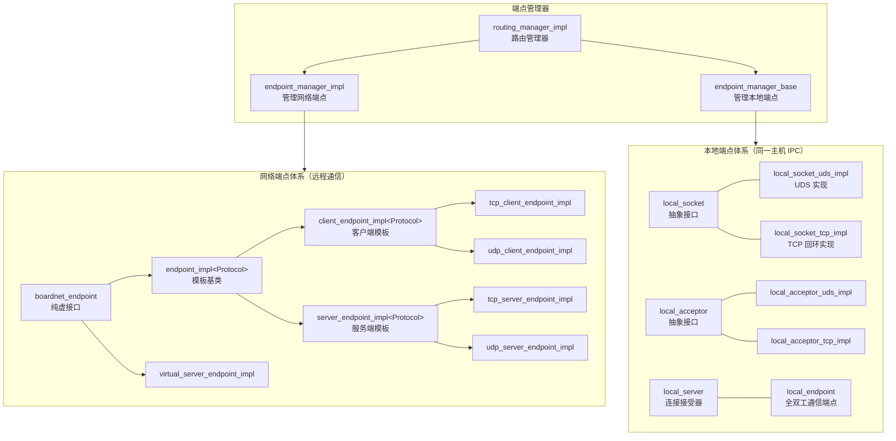

### 两个体系的分工

| 体系 | 基类 | 传输协议 | 用途 | 是否可重启 |
|------|------|----------|------|-----------|
| 网络端点 | `boardnet_endpoint` | TCP/UDP | 跨设备通信 | 可重启（自动重连） |
| 本地端点 | （独立，无统一基类） | UDS/TCP 回环 | 同一设备进程间 IPC | 不可重启（失败即终止） |

---

## 二、网络端点核心类层次

### 2.1 boardnet_endpoint — 根接口

```cpp
class boardnet_endpoint {
    virtual void start() = 0;
    virtual void stop(bool _due_to_error) = 0;
    virtual void restart(bool _force) = 0;
    virtual bool send(const byte_t*, uint32_t) = 0;
    virtual bool send_to(const std::shared_ptr<endpoint_definition>, const byte_t*, uint32_t) = 0;
    virtual void receive() = 0;
    virtual bool is_reliable() const = 0;
    virtual bool is_local() const = 0;
    virtual bool is_client() const = 0;
    virtual bool is_closed() const = 0;
    virtual bool is_established() const = 0;
    virtual uint16_t get_local_port() const = 0;
    virtual size_t get_queue_size() const = 0;
};
```

所有端点操作的最顶层抽象，定义了端点的生命周期（start/stop/restart）和数据收发（send/send_to/receive）接口。

### 2.2 endpoint_impl<Protocol> — 模板中间层

```cpp
template<typename Protocol>
class endpoint_impl : public boardnet_endpoint {
    boost::asio::io_context& io_;                    // IO 上下文
    std::weak_ptr<boardnet_endpoint_host> host_;     // 端点事件回调
    std::weak_ptr<boardnet_routing_host> routing_host_; // 消息路由回调
    uint32_t max_message_size_;                      // 最大消息长度
    endpoint_type local_;                            // 本地地址:端口
    std::shared_ptr<configuration> configuration_;   // 配置
};
```

提供共享的基础设施：`io_context`、事件回调宿主、消息大小校验等。两个纯虚方法由子类实现：
- `is_client()` — 客户端返回 true，服务端返回 false
- `receive()` — 启动异步接收

### 2.3 客户端端点 (client_endpoint_impl)

```cpp
template<typename Protocol>
class client_endpoint_impl : public endpoint_impl<Protocol>,
                             public client_endpoint,
                             public std::enable_shared_from_this<...> {
    std::unique_ptr<socket_type> socket_;        // 协议 socket（tcp_socket 或 udp_socket）
    endpoint_type remote_;                       // 远程目标地址
    std::shared_ptr<train> train_;               // 当前正在填充的列车
    std::deque<std::pair<message_buffer_ptr_t, uint32_t>> queue_; // 发送队列
    boost::asio::io_context::strand strand_;     // 异步操作串行化
};
```

客户端端点是**主动发起连接**的一方：

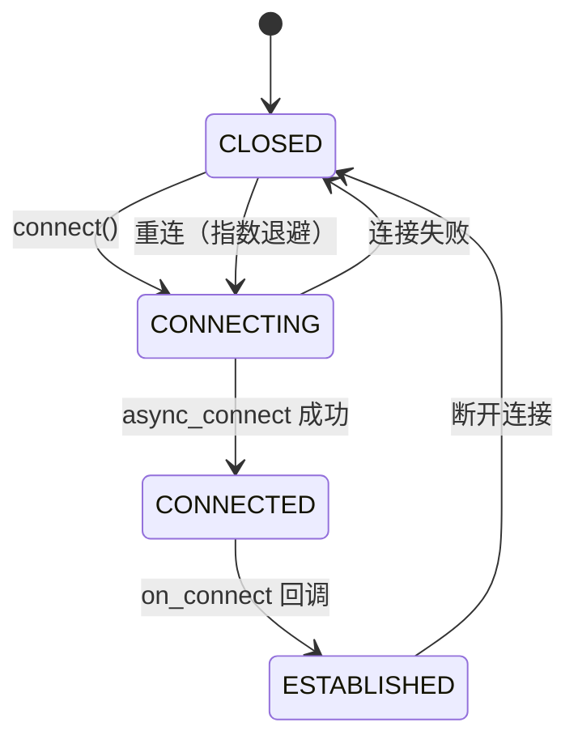

**核心能力**：
- 连接状态机（CLOSED → CONNECTING → CONNECTED → ESTABLISHED）
- Train 批发送机制（见第五节）
- 断线自动重连（指数退避）
- 多路复用（多个服务共享一个 TCP 连接）

### 2.4 服务端端点 (server_endpoint_impl)

```cpp
template<typename Protocol>
class server_endpoint_impl : public endpoint_impl<Protocol>,
                             public std::enable_shared_from_this<...> {
    std::map<endpoint_type, endpoint_data_type> targets_; // 每个远程客户端一个条目
    std::unordered_map<clients_key_t, endpoint_type> clients_to_target_; // 客户端→目标映射
};
```

服务端端点是**被动监听**的一方：

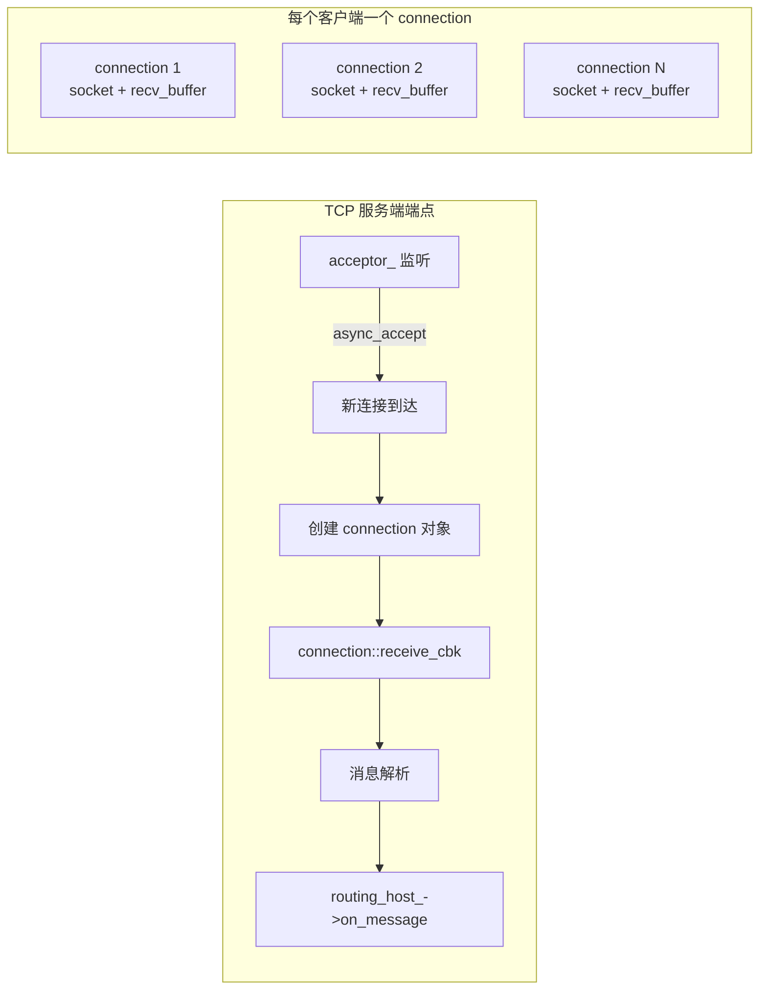

服务端端点维护一个 `targets_` 映射，每个远程客户端对应一个 `endpoint_data_type`，包含独立的发送队列、Train 和时间器。

### 2.5 具体实现类

| 类 | 传输 | 可靠性 | 特有功能 |
|----|------|--------|---------|
| `tcp_client_endpoint_impl` | TCP | 可靠 | Magic Cookie 流同步、发送超时、receive buffer 管理 |
| `udp_client_endpoint_impl` | UDP | 不可靠 | SOME/IP TP 分片重组 |
| `tcp_server_endpoint_impl` | TCP | 可靠 | 内类 `connection` 管理每个客户端、auxiliary_context 独立线程 |
| `udp_server_endpoint_impl` | UDP | 不可靠 | 单播+多播双 socket、多播组管理、TP 重组 |
| `virtual_server_endpoint_impl` | - | - | 轻量占位符，无真实 socket |

### 2.6 端点管理器（Endpoint Manager）

`endpoint_manager_impl` 是路由管理器和端点层之间的桥梁，由 `routing_manager_impl` 直接持有（`ep_mgr_impl_` 成员）：

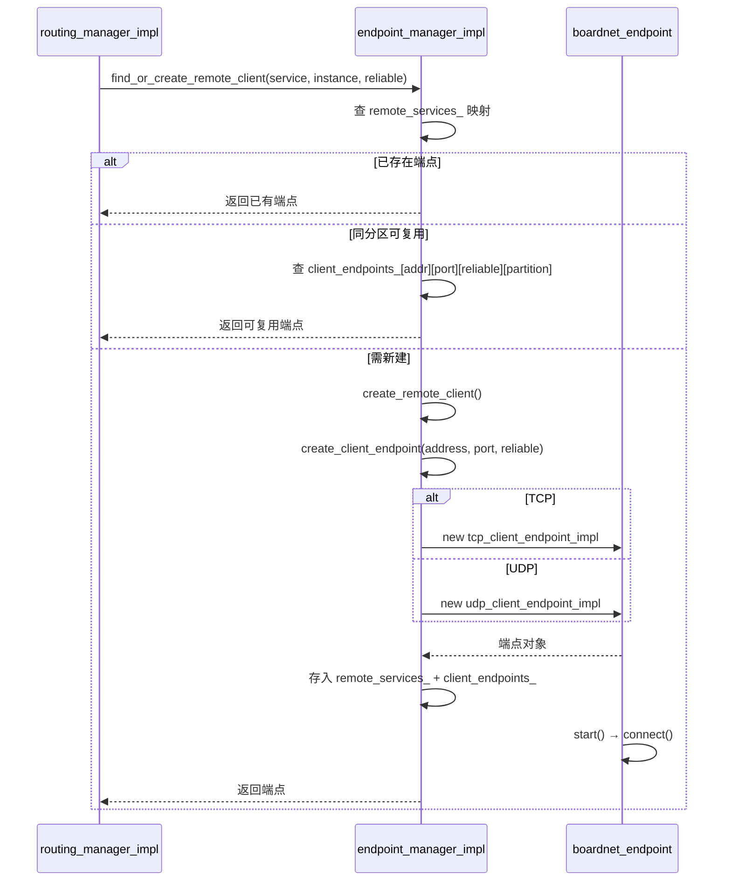

端点管理器维护大量映射来跟踪端点状态：

| 映射 | 键 | 值 | 用途 |
|------|-----|-----|------|
| `remote_service_info_` | service → instance → reliable | `endpoint_definition` | SD 发现的远程地址信息 |
| `remote_services_` | service → instance → reliable | `boardnet_endpoint` | 已创建的活动端点 |
| `client_endpoints_` | address → port → reliable → partition | `boardnet_endpoint` | 出站连接池（可复用） |
| `server_endpoints_` | port → reliable | `boardnet_endpoint` | 入站监听端点 |
| `service_instances_` | service → endpoint_ptr | instance | 反向查找 |
| `multicast_info_` | service → instance | `endpoint_definition` | 多播组信息 |

---

## 三、本地端点体系

本地端点用于**同一主机内**进程间通信，其类层次完全独立于网络端点。

### 3.1 Socket 抽象层

```
local_socket（抽象接口）
  ├── local_socket_uds_impl  — UDS 实现（Linux/QNX）
  └── local_socket_tcp_impl  — TCP 回环实现

local_acceptor（抽象接口）
  ├── local_acceptor_uds_impl  — UDS 接收器
  └── local_acceptor_tcp_impl  — TCP 接收器
```

`local_socket` 定义了异步连接、收发、停止和凭据提取接口。
`local_acceptor` 定义了异步接受连接接口。

两种传输方式对比：

| 维度 | UDS | TCP 回环 |
|------|-----|----------|
| 地址形式 | 文件路径 (`/tmp/vsomeip-xxx`) | IP:Port |
| 性能 | 更高（内核内部传递） | 稍低（走完整的 TCP 栈） |
| 安全 | SO_PEERCRED 获取 UID/GID | 地址/端口验证 |
| 平台 | Linux/QNX | 所有平台 |

### 3.2 local_server — 连接接受器

`local_server` 是本地连接的**服务端接受器**，继承自 `enable_shared_from_this`（不继承 `boardnet_endpoint`）。

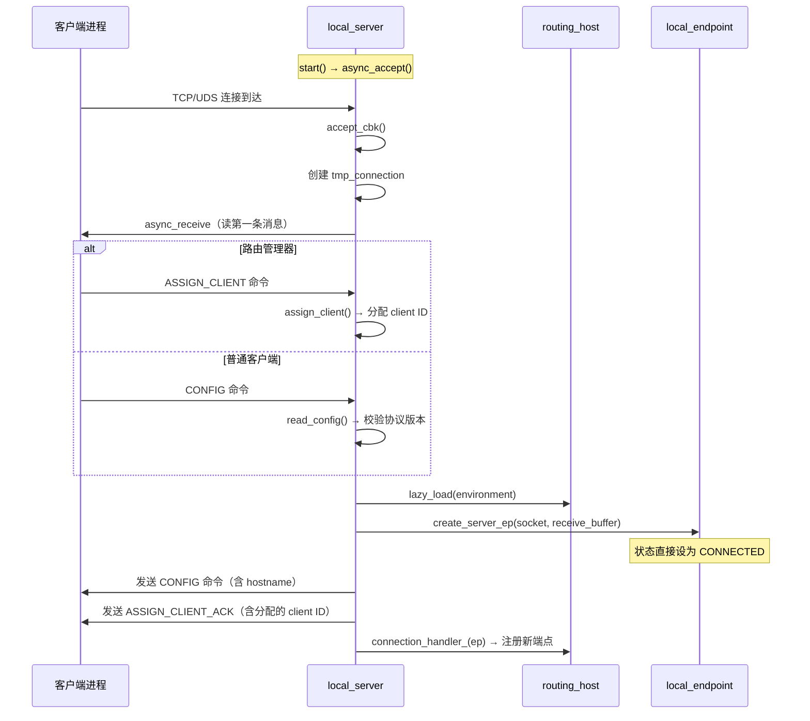

**tmp_connection 握手协议**：新连接的第一个消息必须是 `ASSIGN_CLIENT`（路由管理器才处理）或 `CONFIG` 命令。握手完成后才生成正式的 `local_endpoint`。

### 3.3 local_endpoint — 全双工通信端点

`local_endpoint` 是本地 IPC 的实际工作单元，非模板类，不可重启。

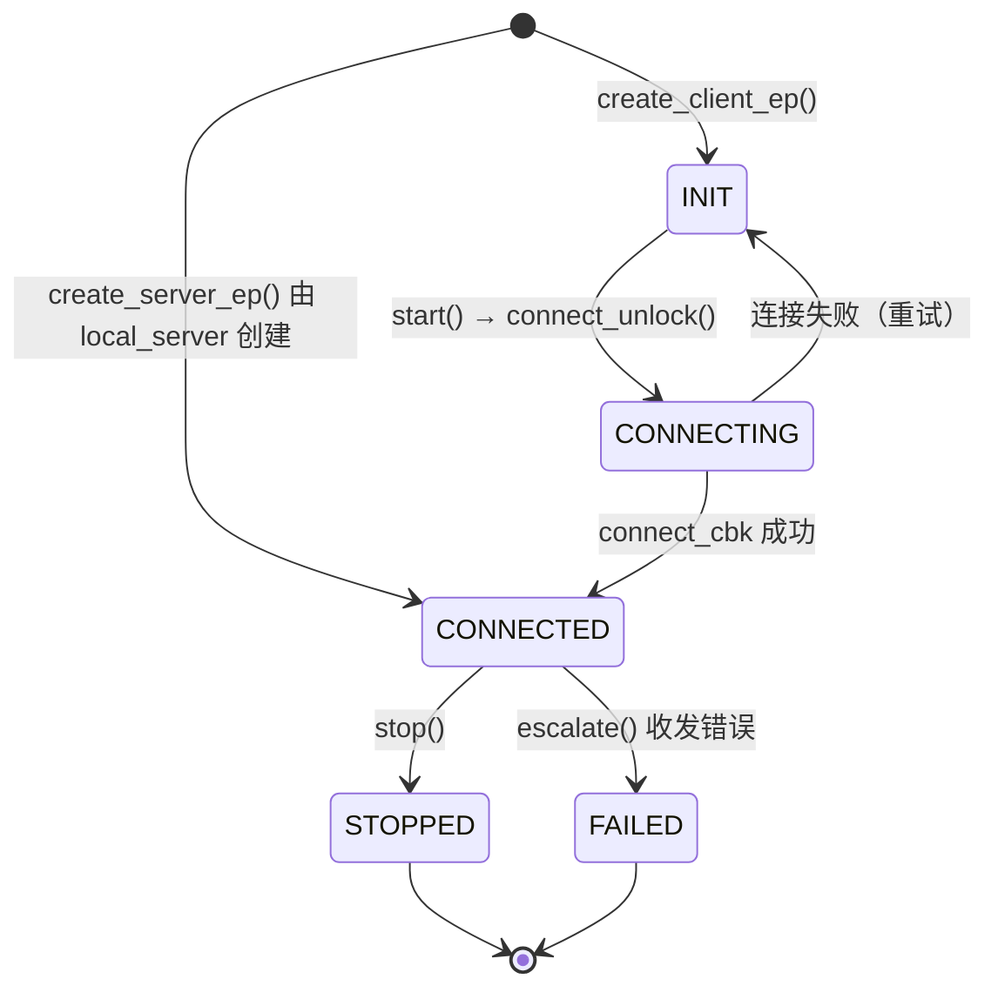

**收发流程**：

```mermaid
graph TD
    subgraph SEND["发送路径"]
        A[send(data, size)] --> B{CONNECTED && !is_sending?}
        B -->|是| C[send_unlock]
        B -->|否| D[入队 send_queue_]
        C --> E[send_buffer_unlock]
        E --> F[socket_->async_send]
        F --> G[send_cbk]
        G -->|成功| H{队列还有数据?}
        H -->|是| C
        H -->|否| I[clear is_sending_]
        G -->|失败| J[escalate → FAILED]
    end

    subgraph RECV["接收路径"]
        K[socket_->async_receive] --> L[receive_cbk]
        L --> M[process(new_bytes)]
        M --> N[receive_buffer_->next_message]
        N --> O{完整消息?}
        O -->|是| P[routing_host_->on_message]
        O -->|否 且需要扩容| Q[add_capacity]
        O -->|否| K
        P --> N
    end
```

**安全机制**：`is_allowed()` 方法通过 SO_PEERCRED（UDS）或地址/端口验证（TCP）检查对端是否有权限通信。

---

## 四、三种传输对比

vsomeip 支持三种传输介质，分别针对不同的场景：

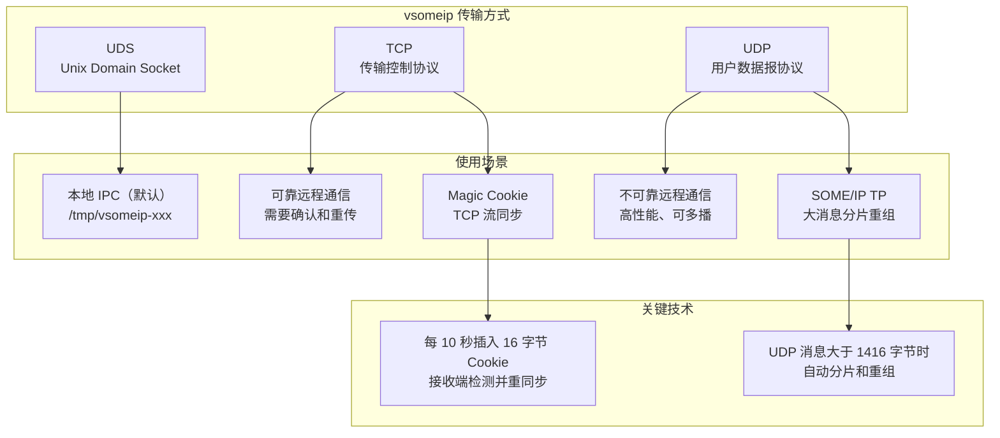

| 特性 | UDS | TCP | UDP |
|------|-----|-----|-----|
| **可靠** | 是（流式） | 是（重传+确认） | 否 |
| **面向连接** | 是 | 是 | 否 |
| **多播** | 否 | 否 | 是 |
| **保序** | 是 | 是 | 否 |
| **Magic Cookie** | 否 | 是 | 否 |
| **SOME/IP TP** | 否 | 否 | 是 |
| **连接复用** | 否（每个 client 一个连接） | 是（多服务共享） | N/A |
| **自动重连** | 否 | 是 | 是（UDP 状态重置） |
| **内核开销** | 低 | 中 | 低 |

---

## 五、Train 批发送机制

vsomeip 的端点使用 **Train（列车）** 模式来批处理消息发送，将多个小消息合并成一次系统调用，显著提高吞吐量。

### 5.1 Train 数据结构

```cpp
struct train {
    message_buffer_ptr_t buffer_;                    // 合并后的数据缓冲区
    std::set<std::pair<service_t, method_t>> passengers_; // 哪些服务/方法的消息在其中
    std::chrono::nanoseconds minimal_debounce_time_;      // 最小去抖时间
    std::chrono::nanoseconds minimal_max_retention_time_; // 最大保留时间
    std::chrono::steady_clock::time_point departure_;     // 发车时间
};
```

### 5.2 发送决策流程

```mermaid
flowchart TD
    A[send(data, size) 被调用] --> B[取消当前 dispatch 定时器]
    B --> C{连接状态 >= ESTABLISHED?}
    C -->|否| D[直接入队 queue_]
    C -->|是| E{新消息和 train 中最后一个重复?}
    E -->|是| F[替换为最新版本<br/>（去抖优化）]
    E -->|否| G{添加后超过 max_message_size?}
    G -->|是| H[train 必须发车]
    G -->|否| I{距上次发车超过 debouncing 时间?}
    I -->|是| H
    I -->|否| J{train 最旧消息超过 retention 时间?}
    J -->|是| H

    H --> K[当前 train 编组完成<br/>存入 dispatched_trains_]
    K --> L[创建新 train]
    L --> M[新消息加入新 train]

    J --> N[消息追加到当前 train buffer]

    M --> O[设置 dispatch 定时器<br/>timer = now + min(debouncing, retention)]
    N --> O

    O --> P[定时器触发 → flush_cbk]
    P --> Q[所有到期的 train 移入 queue_]
    Q --> R[send_queued → async_write]
```

### 5.3 Train 参数来源

每个服务/方法可以配置不同的时间参数（在 `vsomeip.json` 中）：

```
"debounce_time": 500     — 去抖时间（微秒）
"max_retention_time": 1000 — 最大保留时间（微秒）
```

一个 train 中所有乘客的 `minimal_debounce_time_` 取最小值，保证最紧急的消息不被延迟。

### 5.4 Train 生命周期

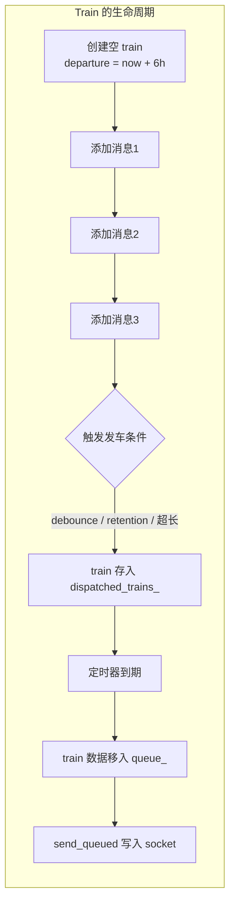

多个 train 可以同时存在 `dispatched_trains_` 映射中，按发车时间索引。

---

## 六、接收路径与消息解析

### 6.1 TCP 接收与流重同步

TCP 是流式协议，vsomeip 需要自行处理**消息边界**。每个 TCP 端点（客户端或服务端）使用 `receive_cbk` 处理接收到的数据：

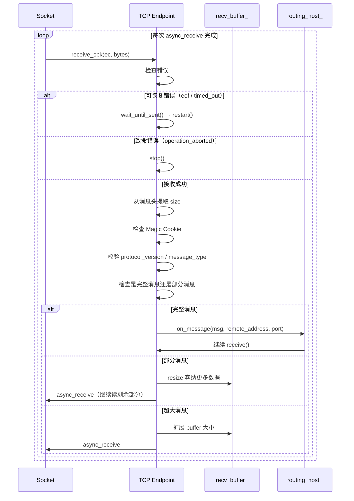

**Magic Cookie 机制**：TCP 端点每隔 10 秒在发送数据中插入 16 字节的 Magic Cookie（`0xFF 0xFF ... 0xDE 0xAD 0xBE 0xEF`）。接收端检测到 Cookie 可判断 TCP 流是否同步，若发现 Cookie 出现在非预期位置（即流已失步），则跳过该位置的数据重新同步。

### 6.2 UDP 接收与 TP 重组

UDP 是数据报协议，本身有消息边界，但 SOME/IP TP（Transport Protocol）支持对超过 1416 字节的大消息进行分片：

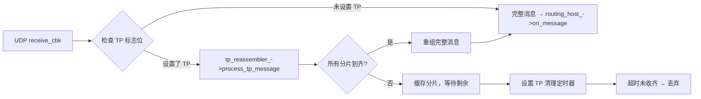

### 6.3 本地端点消息解析

`local_receive_buffer` 是偏移量（offset）驱动的环形缓冲区，专为本地 IPC 的 9 字节命令头格式设计。

```
   0        1         3         5          9          N
+---------+---------+---------+----------+----------+--------+
| Command | Version | Client  |  Length  | Payload  |        |
|  ID(1)  |  (2)    |  ID(2)  |   (4)    |          |        |
+---------+---------+---------+----------+----------+--------+
|<-------- COMMAND_HEADER_SIZE = 9 ------>|<-- length -->|
```

解析逻辑：
1. 检查缓冲区是否 >= 9 字节
2. 读取 offset 5 处的 4 字节 `length` 字段
3. 校验 `length <= max_message_length_`
4. 计算总大小 = 9 + length
5. 检查缓冲区是否包含完整消息 → 是则返回消息指针，否则等待更多数据

---

## 七、消息的完整路由路径

当应用发送一条消息到远程设备时，完整的路径经过以下层级：

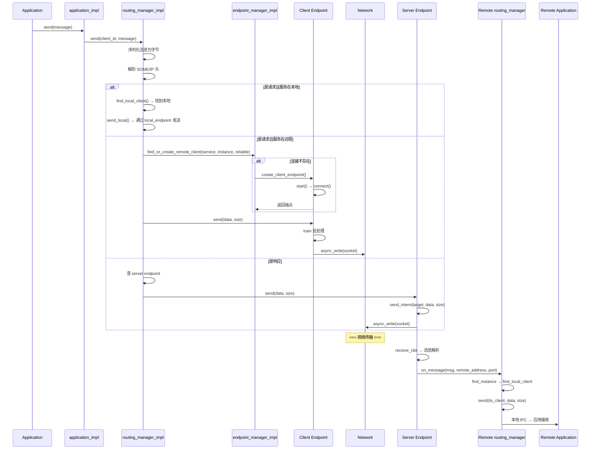

### 7.1 本地路由路径

当目标服务在**同一设备**上时，消息通过 `send_local` 走 UDS/TCP 本地 IPC：

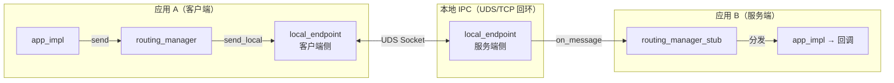

### 7.2 服务端初始化端点

当应用调用 `offer_service()` 时，路由管理器创建对应的服务端端点：

```mermaid
flowchart TD
    A[offer_service(service, instance)] --> B[routing_manager_impl::init_service_info]
    B --> C{是否本地服务?}
    C -->|是| D[不需要网络端点<br/>只需等待本地客户端]
    C -->|否| E{已有可靠服务?}
    E -->|是| F[查或创建 0x0001 端口 TCP 服务端端点]
    F --> G[bind → listen → async_accept]
    E -->|否| H{已有不可靠服务?}
    H -->|是| I[查或创建不可靠端口 UDP 服务端端点]
    I --> J[bind → 开始接收]
    H -->|否| K[结束]
```

### 7.3 SD 发现后创建客户端端点

当 Service Discovery 收到远程的 OfferService 消息时：

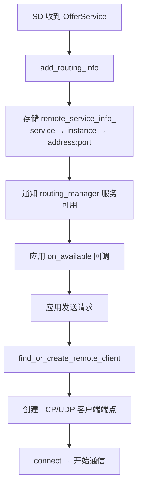

---

## 八、线程模型与锁策略

vsomeip 的端点层使用 **多线程 + Boost.Asio 异步模型**，每个端点组件有特定的线程安全策略：

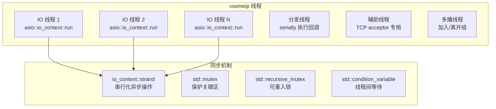

### 锁层级

| 组件 | 同步机制 | 保护对象 |
|------|---------|----------|
| `client_endpoint_impl` | `strand_`（strand） | send_queued/receive/timer 回调串行化 |
| `client_endpoint_impl` | `mutex_`（recursive_mutex） | train_、queue_、queue_size_ |
| `client_endpoint_impl` | `socket_mutex_`（mutex） | socket 打开/关闭/状态查询 |
| `server_endpoint_impl` | `mutex_`（mutex） | targets_ 映射 |
| `server_endpoint_impl` | `clients_mutex_`（mutex） | clients_to_target_ 映射 |
| `local_endpoint` | `mutex_`（mutex） | 状态和队列 |
| `local_server` | `mtx_`（mutex） | 生命周期计数器 |
| `tcp_server_endpoint_impl` | `acceptor_mutex_` | acceptor 访问 |
| `tcp_server_endpoint_impl` | `connections_mutex_` | connections_ 映射 |
| `endpoint_manager_impl` | `endpoint_mutex_` | 所有端点映射 |
| `udp_server_endpoint_impl` | `lifecycle_idx`（atomic） | 异步 handler 有效性 |

### 关键设计：stale handler 防御

为了防止异步回调在端点已停止后执行，使用两种策略：

1. **Lifecycle Counter**（`local_server`/`udp_server_endpoint_impl`）：
   - 每次 `start/stop` 递增计数器
   - 回调中检查当前计数和发起时的计数是否匹配
   - 不匹配则丢弃回调（stale）

2. **weak_from_this + lock**（所有 `enable_shared_from_this` 类）：
   - 异步 lambda 中先 lock() 检查对象是否存活
   - 已析构则不执行

---

## 九、断线重连机制

### TCP/UDP 客户端重连

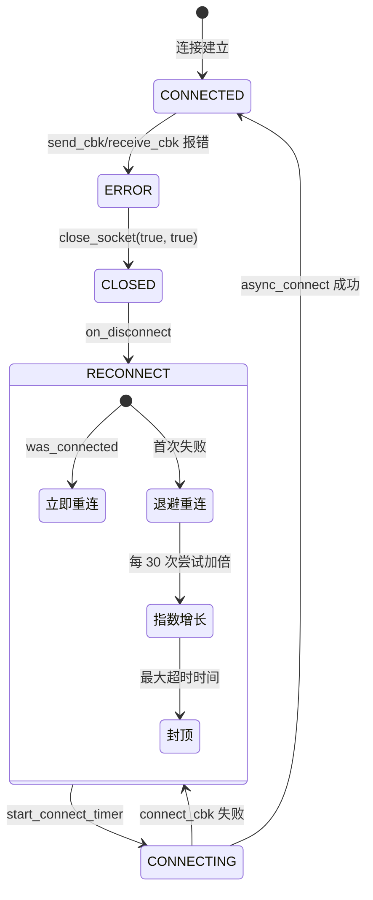

**退避算法**：
- 基础超时：`VSOMEIP_DEFAULT_CONNECT_TIMEOUT`
- 每 30 次重试，超时翻倍
- 上限：`VSOMEIP_MAX_CONNECT_TIMEOUT`

### 本地端点错误处理

本地端点**不可重启**，一旦出错直接进入 FAILED 状态：

```
send_cbk/receive_cbk 错误 → escalate() → 状态 FAILED → error_handler 回调
```

---

## 十、Socket 抽象与工厂模式

为使端点层可测试，vsomeip 将 Boost.Asio 的 socket 类型全部抽象为接口：

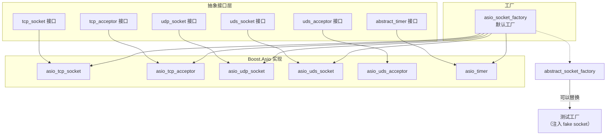

**工厂替换机制**：通过 `set_abstract_factory()` 可以在测试时替换为模拟工厂，注入假 socket 对象，无需真正的网络连接即可测试端点逻辑。

---

## 十一、配置与端口管理

### 11.1 端口分配

`endpoint_manager_impl` 管理本地客户端端口的分配：

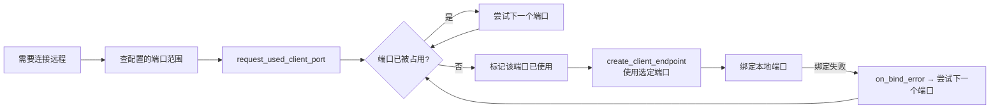

### 11.2 分区感知的端点复用

同一远程地址+端口的多个服务可以**共享同一个 TCP 连接**，通过 `partition_id_t` 维度实现复用：

```cpp
// 复用条件：同一 address + port + reliable + partition
client_endpoints_[address][port][reliable][partition] → endpoint

// 查找时先看 partition 是否匹配
find_remote_client() 在 remote_services_ 中找不到时，
  检查同地址+端口+可靠性+分区的已有端点，
  若存在则直接复用，不创建新端点。
```

---

## 十二、三种模式的端点交互示例

以 Field 模式为例，展示端点层的完整交互过程：

```mermaid
sequenceDiagram
    participant SC as Service Client
    participant LEC as local_endpoint<br/>（客户端侧）
    participant RMR as routing_manager<br/>（路由管理器）
    participant EMI as endpoint_manager
    participant S as local_server
    participant LES as local_endpoint<br/>（服务端侧）
    participant SR as Service 应用

    Note over SC,SR: 应用启动与注册
    SC->>LEC: init() + start()
    LEC->>S: connect → ASSIGN_CLIENT/CONFIG
    S->>LES: create_server_ep → CONNECTED
    S->>LEC: ASSIGN_CLIENT_ACK
    LEC->>LEC: 状态 → CONNECTED
    LEC->>RMR: on_register_application

    Note over SC,SR: 服务端 offer_service
    SR->>RMR: offer_service(0x1113, 0x2222)
    RMR->>EMI: find_or_create_server_endpoint
    Note over EMI: 创建 tcp_server_endpoint_impl<br/>或 udp_server_endpoint_impl

    Note over SC,SR: 客户端 request_service
    SC->>LEC: request_service
    LEC->>RMR: 通过 local_endpoint 发送请求
    RMR->>EMI: find_or_create_remote_client
    Note over EMI: 创建 tcp_client_endpoint_impl

    Note over SC,SR: 发送 Field GET 请求
    SC->>LEC: send (SOME/IP 消息)
    LEC->>RMR: on_message（本地 IPC 送达）
    RMR->>EMI: 查 remote_services_ → 找到客户端端点
    RMR->>EP[tcp_client_endpoint]: send(data, size)
    EP->>EP: 加入 train
    EP->>NET[网络]: async_write → TCP 发送

    Note over NET: 网络传输

    NET->>SEP[tcp_server_endpoint]: receive_cbk
    SEP->>SEP: 消息解析 + Magic Cookie 检查
    SEP->>RMR: on_message(msg)
    RMR->>SR: send_local → local_endpoint
    SR->>SR: 处理 GET，返回响应
    SR->>RMR: send(response)
    RMR->>SEP: send(data, size)
    SEP->>SEP: send_intern(target, data)
    SEP->>NET: async_write
```

---

## 十三、总结

vsomeip 的端点层是框架中最接近操作系统的部分，承担着所有网络传输职责：

| 维度 | 设计要点 |
|------|---------|
| **分层** | 根接口 → 模板基类 → 客户端/服务端分支 → TCP/UDP 具体实现 |
| **双体系** | 网络端点（可重连）和本地端点（不可重启）完全独立 |
| **批发送** | Train 机制合并小消息，debounce/retention 控制延迟 |
| **流同步** | TCP Magic Cookie 检测和恢复失步的字节流 |
| **分片** | UDP SOME/IP TP 支持大消息的分片和重组 |
| **线程安全** | strand + mutex + 生命周期计数器的三级防护 |
| **可测试** | Socket 抽象接口 + 工厂模式，支持 mock 注入 |
| **多路复用** | 同一 TCP 连接承载多个服务，按 partition 共享 |

### 核心文件索引

| 文件 | 内容 |
|------|------|
| `endpoints/include/boardnet_endpoint.hpp` | 根接口定义 |
| `endpoints/include/endpoint_impl.hpp` | 模板基类 |
| `endpoints/include/client_endpoint_impl.hpp` | 客户端端点模板 |
| `endpoints/include/server_endpoint_impl.hpp` | 服务端端点模板 |
| `endpoints/src/tcp_client_endpoint_impl.cpp` | TCP 客户端实现 |
| `endpoints/src/udp_client_endpoint_impl.cpp` | UDP 客户端实现 |
| `endpoints/src/tcp_server_endpoint_impl.cpp` | TCP 服务端实现 |
| `endpoints/src/udp_server_endpoint_impl.cpp` | UDP 服务端实现 |
| `endpoints/include/local_endpoint.hpp` | 本地端点 |
| `endpoints/src/local_endpoint.cpp` | 本地端点实现 |
| `endpoints/include/local_server.hpp` | 本地连接接受器 |
| `endpoints/src/local_server.cpp` | 本地连接接受器实现 |
| `endpoints/include/local_socket_uds_impl.hpp` | UDS Socket |
| `endpoints/include/local_socket_tcp_impl.hpp` | TCP 回环 Socket |
| `endpoints/include/endpoint_manager_impl.hpp` | 端点管理器 |
| `endpoints/src/endpoint_manager_impl.cpp` | 端点管理器实现 |
| `endpoints/include/buffer.hpp` | Train 结构和 buffer 定义 |
| `endpoints/include/local_receive_buffer.hpp` | 本地接收缓冲区 |
