# vsomeip 路由内部实现原理

本文深入分析 vsomeip 3.7.2 的路由（Routing）内部机制，涵盖架构设计、启动流程、注册握手、消息路由、UDS 通信、IPC 协议和线程模型。

---

## 1. 架构概述

vsomeip 的本地通信采用 **星型拓扑**：一个中心化的 **路由管理器（Routing Manager）** 作为枢纽，所有应用进程通过 Unix Domain Socket (UDS) 与之相连。

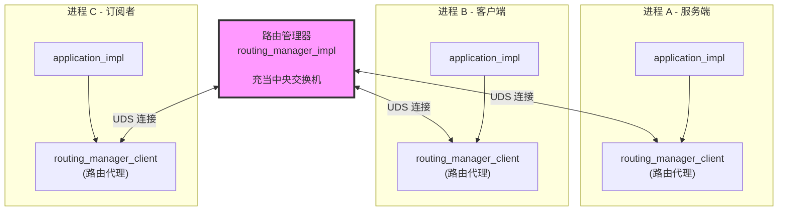

**关键设计决策：所有本地消息必须经过路由管理器。** 服务端和客户端不在进程中直接通信，而是通过路由管理器中转。这带来几个好处：

- **安全策略集中管控**：路由管理器可检查每条消息的权限
- **服务发现统一**：所有 offer/request 信息汇聚在路由管理器
- **订阅管理集中**：事件通知的分发由路由管理器完成

---

## 2. 核心组件与类层次

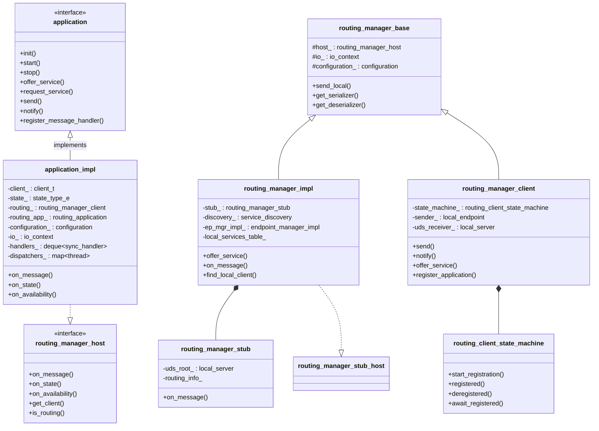

### 组件角色

| 组件 | 所在进程 | 职责 |
|------|---------|------|
| `application_impl` | 每个应用进程 | 用户 API 的实现，管理 handler 注册与分发 |
| `routing_manager_impl` | 路由管理器进程 | 中央交换机，维护服务路由表，转发消息 |
| `routing_manager_stub` | 路由管理器进程 | UDS 服务端，接受客户端连接，解析 IPC 协议命令 |
| `routing_manager_client` | 非路由应用进程 | 路由代理，通过 UDS 连接到路由管理器，发送/接收消息 |
| `routing_client_state_machine` | 非路由应用进程 | 管理注册状态机 DEREGISTERED → REGISTERING → REGISTERED |

---

## 3. 应用启动流程

从用户代码 `runtime::get()->create_application("name")` 到应用就绪的完整序列：

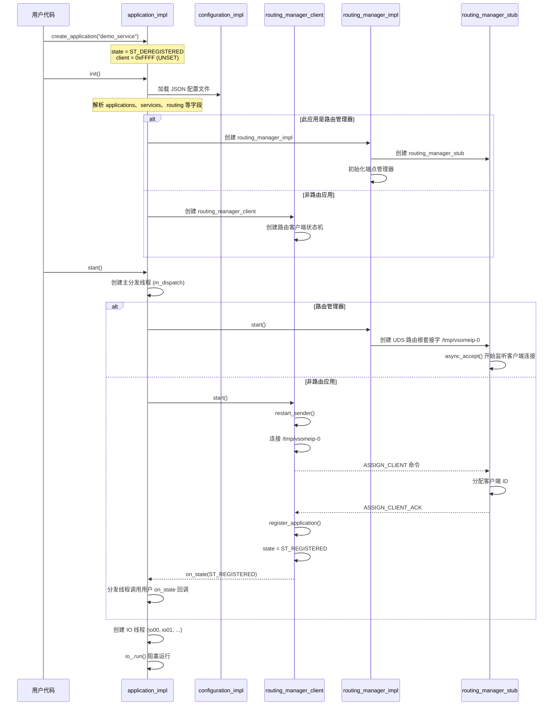

### 状态机转换

```
 ST_DEREGISTERED ──start_registration()──> ST_REGISTERING ──registered()──> ST_REGISTERED
        ^                                       │
        └──────────deregistered()───────────────┘
```

- **ST_DEREGISTERED**：初始状态，未连接到路由管理器
- **ST_REGISTERING**：已发起 ASSIGN_CLIENT，等待 ACK
- **ST_REGISTERED**：注册完成，可正常通信

---

## 4. 注册握手 (ASSIGN_CLIENT / ASSIGN_CLIENT_ACK)

每个非路由应用启动时，需要与路由管理器完成注册握手才能获得合法客户端 ID。

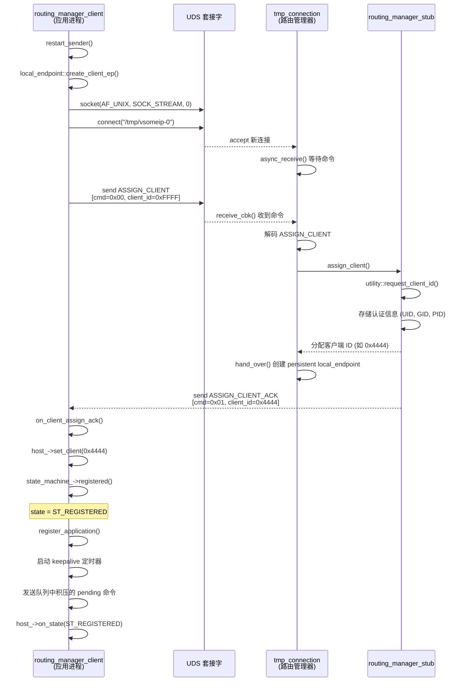

**关键细节：**

- 路由根套接字路径为 `/tmp/vsomeip-0`（配置中 `network` 字段不为空时为 `/tmp/vsomeip-{network}-0`）
- 客户端 ID 优先从配置文件 `applications[].id` 读取，未配置则自动分配
- 每个应用被分配唯一的 UDS 接收端路径 `/tmp/vsomeip-{client_id}`（如 `/tmp/vsomeip-4444`）
- 路由管理器的客户端 ID 固定为 `0x0000`

---

## 5. 服务注册与发现

### 5.1 offer_service — 服务端注册服务

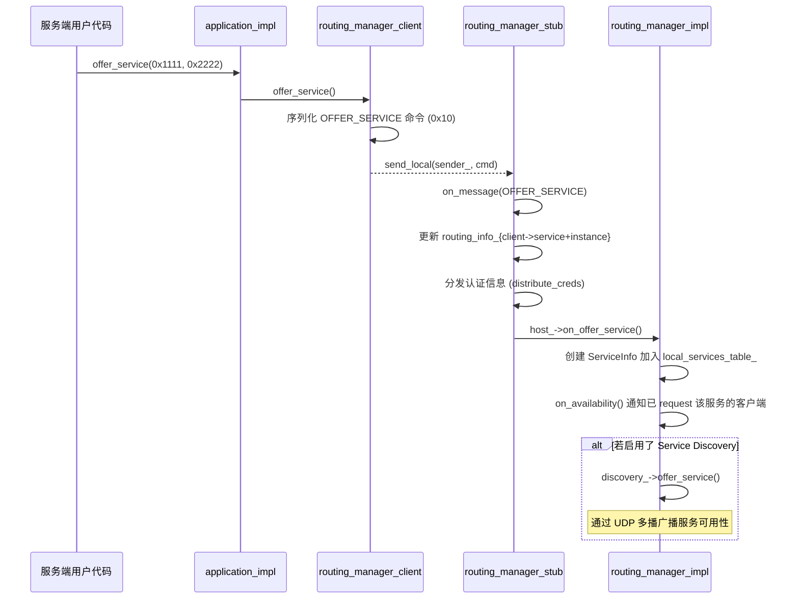

### 5.2 request_service — 客户端发现服务

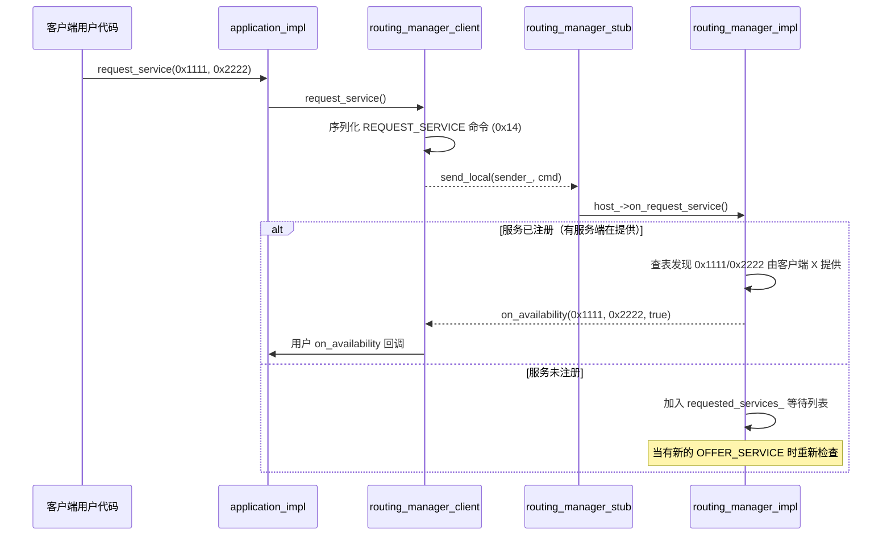

---

## 6. 消息路由 — 请求/响应全流程

这是最核心的消息通路：客户端发送请求 → 路由管理器转发 → 服务端处理 → 响应返回。

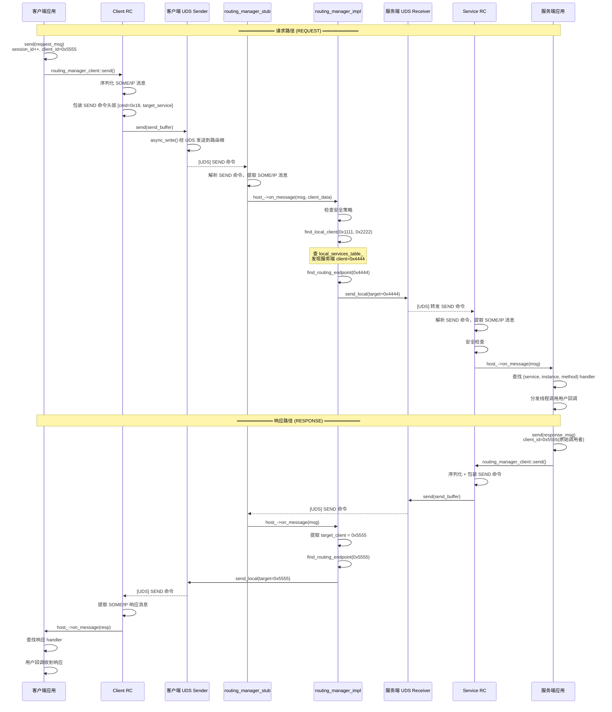

### 关键点

1. **序列化与反序列化**：`routing_manager_base` 维护序列化器/反序列化器池（每个 IO 线程一个），将 SOME/IP 消息序列化为字节流
2. **目标查找**：`routing_manager_impl::find_local_client()` 查 `local_services_table_` 映射 `(service, instance) → client_id`
3. **消息头部**：原始 SOME/IP 消息中的 `client_id` 字段记录了发起者，响应时用于回寻
4. **安全策略**：每条消息都经过 `check_security_policy()` 验证

---

## 7. 事件通知路由

事件通知是一对多的广播模式，发布者通知一次，路由管理器分发给所有订阅者。

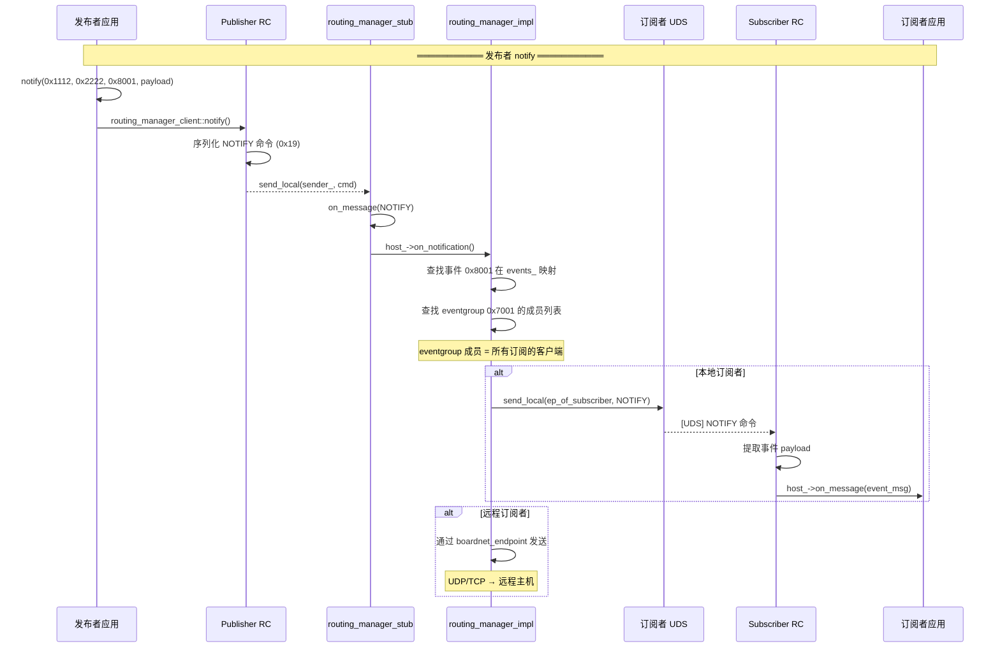

### 事件注册流程

订阅者必须完成两步才能接收事件：

1. **request_event**：告诉路由管理器本应用要监听某个事件
2. **subscribe**：订阅 eventgroup，加入广播列表

```
订阅者                   路由管理器
   │                        │
   │── request_event() ────>│  注册事件到 events_ 映射
   │                        │
   │── subscribe() ────────>│  加入 eventgroup 成员表
   │                        │
   │  <── NOTIFY ───────────│  发布者 notify 时转发
```

---

## 8. UDS 通信机制

### 8.1 套接字路径约定

| 角色 | 路径 | 创建者 | 用途 |
|------|------|--------|------|
| 路由根 | `/tmp/vsomeip-0` | `routing_manager_stub` | 监听客户端连接 |
| 应用接收端 | `/tmp/vsomeip-{client_id}` | `routing_manager_client` | 接收路由管理器转发消息 |
| 示例：服务端 | `/tmp/vsomeip-4444` | demo_service 的 RC | 服务端接收消息 |
| 示例：客户端 | `/tmp/vsomeip-5555` | demo_client 的 RC | 客户端接收消息 |

### 8.2 套接字拓扑

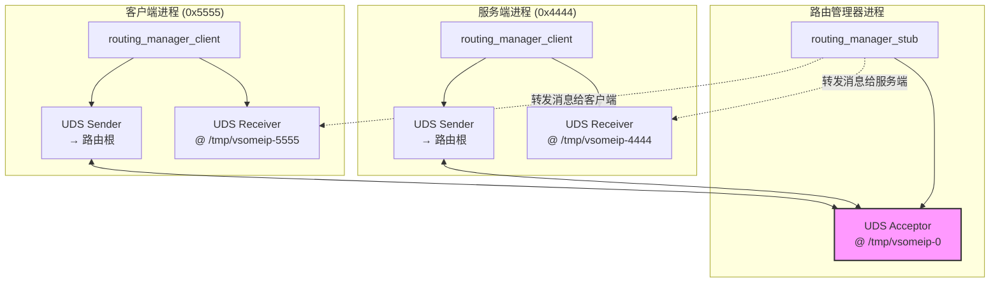

### 8.3 连接生命周期

```
路由管理器端（服务端）：
  1. init_routing_endpoint()
     → local_acceptor_uds_impl::init()
       → open() 打开套接字
       → unlink() 清理陈旧套接字文件
       → bind() 绑定到 /tmp/vsomeip-0
       → listen() 开始监听
       → chmod() 设置权限
  2. local_server::start()
     → async_accept() 循环接受连接
  3. 客户端连入
     → tmp_connection 处理握手
     → hand_over() → 创建 persistent local_endpoint
     → add_connection() → 注册新客户端

客户端端：
  1. restart_sender()
     → local_endpoint::create_client_ep()
       → local_socket_uds_impl
       → prepare_connect() 打开套接字
       → async_connect("/tmp/vsomeip-0")
  2. 连接成功 → 发送 CONFIG 命令
  3. 接收 ASSIGN_CLIENT_ACK → 握手完成
```

### 8.4 双工通信

每个非路由应用维护 **两条 UDS 通道**：

- **Sender（发送者）**：客户端 → 路由管理器。用于发送命令 (OFFER_SERVICE, SEND, NOTIFY 等)
- **Receiver（接收者）**：路由管理器 → 客户端。路由管理器在此端口上推送消息给客户端

这种设计使得路由管理器可以主动向客户端推送消息（如事件通知、可用性变更），而不需要客户端持续轮询。

---

## 9. IPC 协议格式

所有 UDS 传输使用自定义二进制协议（非 SOME/IP 协议，而是内部进程间控制协议）。

### 通用命令头部 (9 字节)

```
Byte 0:      命令 ID
Bytes 1-2:   IPC 协议版本 (大端 uint16)
Bytes 3-4:   客户端 ID (大端 uint16)
Bytes 5-8:   负载大小 (大端 uint32)
Bytes 9+:    命令特有负载
```

### 主要命令 ID

| 命令 | ID | 方向 | 说明 |
|------|----|------|------|
| `ASSIGN_CLIENT` | `0x00` | 客户端 → 路由 | 请求分配客户端 ID |
| `ASSIGN_CLIENT_ACK` | `0x01` | 路由 → 客户端 | 分配确认 |
| `ROUTING_INFO` | `0x05` | 路由 → 客户端 | 服务路由信息广播 |
| `PING` | `0x07` | 路由 → 客户端 | 心跳探测 |
| `PONG` | `0x08` | 客户端 → 路由 | 心跳回复 |
| `OFFER_SERVICE` | `0x10` | 客户端 → 路由 | 注册服务 |
| `STOP_OFFER_SERVICE` | `0x11` | 客户端 → 路由 | 停止注册 |
| `SUBSCRIBE` | `0x12` | 客户端 → 路由 | 订阅事件组 |
| `REQUEST_SERVICE` | `0x14` | 客户端 → 路由 | 请求发现服务 |
| `SEND` | `0x18` | 双向 | 传输 SOME/IP 消息 |
| `NOTIFY` | `0x19` | 客户端 → 路由 | 发布事件通知 |
| `NOTIFY_ONE` | `0x1A` | 客户端 → 路由 | 单播通知 |
| `REGISTER_EVENT` | `0x1B` | 客户端 → 路由 | 注册事件 |
| `CONFIG` | `0x31` | 双向 | 配置信息交换 |

### SEND 命令格式 (15 字节头部 + 负载)

```
Bytes 0-8:   通用命令头部 (cmd=SEND_ID=0x18)
Byte 9:      status 检查标志
Byte 10:     保留
Bytes 11-12: 实例 ID (大端 uint16)
Byte 13:     可靠性标志
Byte 14:     target 端口
Bytes 15+:   SOME/IP 消息字节流 (SOME/IP 头部 + payload)
```

SOME/IP 消息本身包含：
- Service ID, Instance ID, Method ID
- Client ID, Session ID
- Message Type (REQUEST=0x00, RESPONSE=0x80, NOTIFICATION=0x02 等)
- Return Code
- Payload 数据

---

## 10. 线程模型

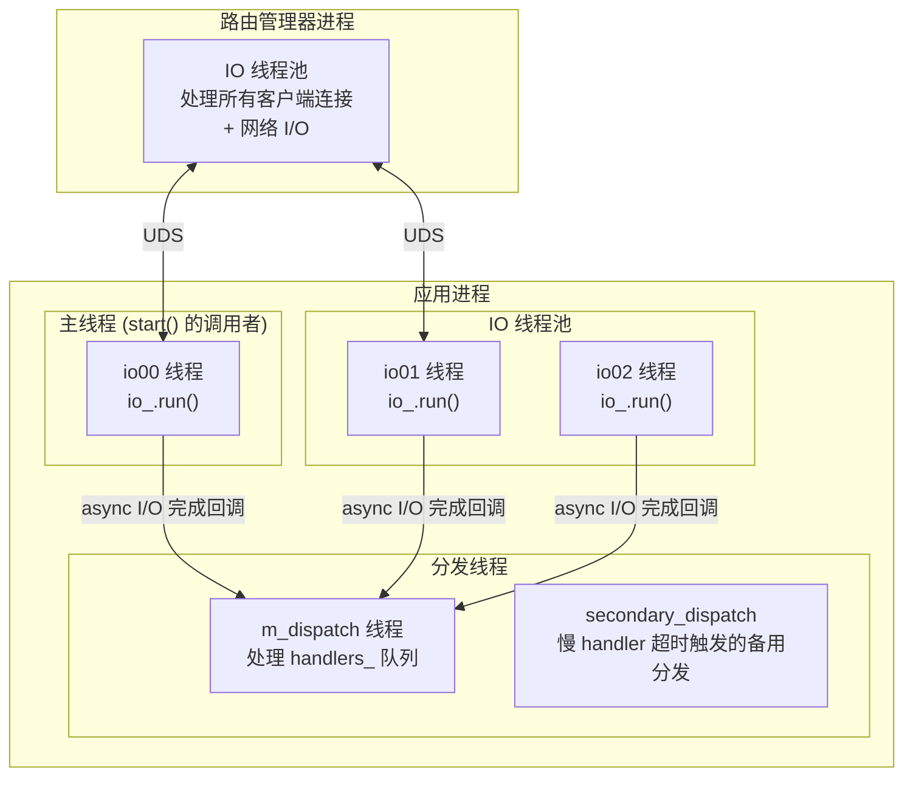

### 线程职责

| 线程 | 数量 | 职责 |
|------|------|------|
| `io00` | 1 | `start()` 的调用者线程，进入 `io_.run()` 事件循环 |
| `io01, io02...` | 可配置（默认 1-2） | 异步 I/O 事件循环，处理套接字读写、定时器 |
| `m_dispatch` | 1 | 从 `handlers_` 队列取出回调并执行（用户 message_handler、state_handler 等） |
| `secondary_dispatch` | 按需（最多 `max_dispatchers_`） | 当 `m_dispatch` 上一个回调执行超过 `max_dispatch_time_` 时创建 |

### 消息分发流程

```
IO 线程收到 UDS 数据
  → 反序列化 IPC 命令
  → 路由查找、转发
  → application_impl::on_message() 被调用
    → 将用户回调封装为 sync_handler
    → 推入 handlers_ 队列
    → 通知 dispatcher_condition_
      → m_dispatch 线程被唤醒
        → 从队列弹出 handler
        → 调用用户回调
```

这种 **IO 线程与分发线程分离** 的设计确保：
- IO 线程不会被用户代码阻塞
- 用户回调按顺序串行执行（一个分发线程）
- 长时间运行的回调不会阻塞 IO 操作

---

## 11. 以 field demo 为例看完整路由

以 `03_field` demo 为例，演示一条 SET 请求从客户端到服务端再到订阅者的完整路径：

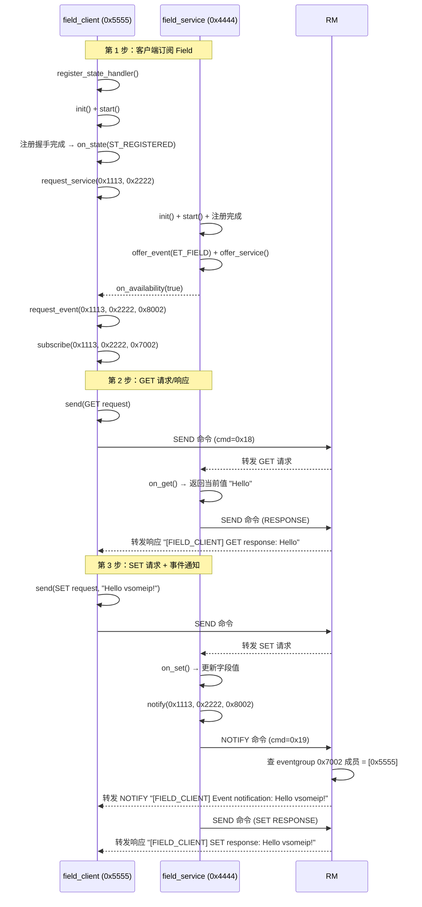

---

## 总结

vsomeip 的路由架构核心思想：

1. **中心化路由**：所有消息经由一个路由管理器进程转发，实现安全管控和统一服务发现
2. **UDS IPC**：通过 Unix Domain Socket 实现高效的本地进程间通信，利用 SO_PEERCRED 进行认证
3. **双通道设计**：每个应用维护一条发送通道和一条接收通道，支持路由管理器主动推送
4. **二进制协议**：自定义 IPC 命令协议（非 SOME/IP），轻量高效
5. **IO 与分发分离**：异步 IO 线程处理网络收发，分发线程串行执行用户回调，互不阻塞

这种架构在保证高效本地通信的同时，提供了集中化的服务发现、事件订阅和安全管理能力，适合汽车电子等对实时性和安全性有严格要求的场景。
